# 04장 처리율 제한 장치의 설계

## 처리율 제한 장치란

네트워크 시스템에서 처리율 제한 장치(Rate Limiter)는  
클라이언트 또는 서비스가 보내는 트래픽의 처리율(Rate)를 제어하기 위한 장치다.

API 요청 횟수가 제한 장치에 정의된 임계치를 넘어서면 추가 호출은 처리가 중단된다.

ex.

- 사용자는 초당 2회 이상 새 글을 올릴 수 없다.
- 같은 IP 주소로는 하루에 10개 이상의 계정을 생성할 수 없다.
- 같은 디바이스로는 주당 5회 아상 리워드를 요청할 수 없다.

## 처리율 제한 장치를 두면 좋은 점

- DoS(Denial of Service) 공격에 의한 자원 고갈을 방지할 수 있다.
- 비용을 점감한다.  
   특히 서드파티 API에 사용료를 지불하는 회사들의 경우
- 서버 과부하를 막는다.

## 1단계 문제 이해 및 설계 범위 확정

Q. 어떤 종류의 처리율 제한 장치인가? 클라이언트 측 제한 장치인지, 서버 측 제한 장치인지  
A. 서버측 API를 위한 장치를 설계한다고 가정

Q. 어떤 기준을 사용해서 API 호출을 제어해야 하는지? IP? 사용자 ID?  
A. 다양한 형태의 제어 규칙을 정의할 수 있는 유연한 시스템

Q. 시스템의 규모는? 스타트업? 사용자가 많은 서비스?  
A. 대규모 요청 처리 가능해야 함

Q. 시스템이 분산 환경에서 동작해야 하나?  
A. 그렇다.

Q. 이 처리율 제한 장치가 독립된 서비스인가? 아니면 애플리케이션 코드에 포함될 수 있나?  
A. 본인이 결정해주세요.

Q. 사용자의 요청이 제한 장치에 의해 걸러진 경우 사용자에게 알려야 하나?  
A. 그렇다.

### 요구사항 정리

- 설정된 처리율을 초과하는 요청은 정확하게 제한한다.
- 낮은 응답시간: HTTP 응답 시간에 나쁜 영향을 주면 안된다.
- 가능한 한 적은 메모리를 사용해야 한다.
- 분산형 처리율 제한(Distributed Rate Limiting): 하나의 처리율 제한 장치를 여러 서버나 프로세스에서 공유할 수 있어야 한다.
- 예외 처리: 요청이 제한되었을 때는 그 사실을 사용자에게 분명하게 보여주어야 한다.
- 높은 결함 감내성(Fault Tolerance): 제한 장치에 장애가 생기더라도 전체 시스템에 영향을 주어서는 안 된다.

## 2단계 개략적 설계안 제시 및 동의 구하기

기본적인 클라이언트-서버 통신 모델을 사용하도록 하자.

### 처리율 제한 장치는 어디에 둘 것인가?

클라이언트 측에 둔다면: 일반적으로 클라이언트는 처리율 제한을 안정적으로 걸 수 있는 장소가 못된다. 클라이언트 요청은 쉽게 위변조가 가능하다.  
모든 클라이언트의 구현을 통제하는 것도 어려울 수 있다.

서버 측에 둔다면:

처리율 제한 장치를 API 서버에 둘 수 있겠다.

또는 처리율 제한 미들웨어를 만들어 API 서버로 가는 요청을 통제하도록 할 수 있다.

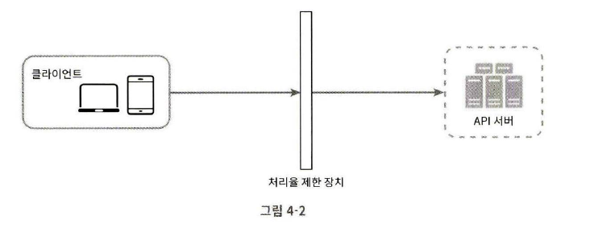
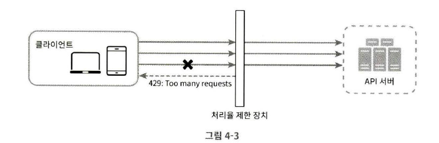

API 서버의 처리율을 초당 2회로 제한한다면 세 번째 요청은 미들웨어에 의해 가로막히고 클라이언트로는 HTTP 상태 코드 429가 반환될 것이다.

- 사용 중인 기술 스택이 서버 측 구현을 지원하기 충분한지 확인
- 사업 필요에 맞는 처리율 제한 알고리즘 선택, 제3 사업자가 제공하는 게이트웨이 사용 시 선택지 제한됨
- 설계가 마이크로서비스에 기반하고 있고, 사용자 인증이나 IP 화이트 리스트 등을 처리하기 위해 API 게이트웨이를 이미 설계에 포함했다면, 처리율 제한 기능 또한 게이트웨이에 포함시켜야 할 수도 있다.
- 처리율 제한 서비스 직접 구현에 필요한 충분한 인력이 없다면 상용 API 게이트웨이 사용이 바람직

### 처리율 제한 알고리즘

- 토큰 버킷(Token Bucket)
- 누출 버킷(Leaky Bucket)
- 고정 윈도 카운터(Fixed Window Counter)
- 이동 윈도 로그(Sliding Window Log)
- 이동 윈도 카운터(Sliding Window Counter)

#### 토큰 버킷 알고리즘

토큰 버킷은 지정된 용량을 갖는 컨테이너다.  
사전 설정된 양의 토큰이 주기적으로 채워진다. 토큰이 꽉 찬 버킷에는 토큰이 추가되지 않는다.

토큰 공급기(Refiller)는 일정 시간마다 버킷에 토큰을 추가한다.  
버킷이 가득 차면 추가로 공급된 토큰은 버려진다.

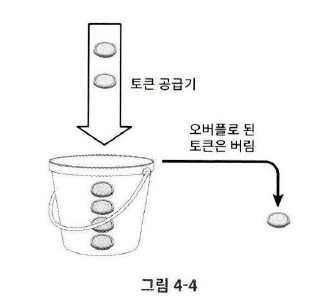

각 요청이 도착하면 버킷에 충분한 토큰이 있는지 검사하여  
충분한 토큰이 있는 경우 버킷에서 토큰 하나를 꺼낸 후 요청을 시스템으로 전달,  
충분한 토큰이 없는 경우 해당 요청은 버려진다.

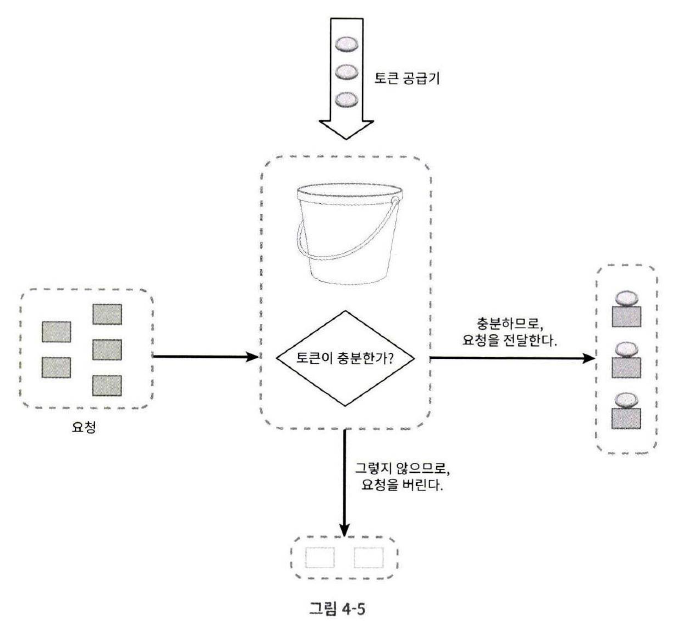

버킷은 몇 개나 사용해야 하는지는 공급 제한 규칙에 따라 달라진다.

- 통상적으로 API 엔드포인트 마다 별도의 버킷을 둔다.  
  예를 들어 사용자마다 하루에 한 번만 포스팅을 할 수 있고, 친구는 150명까지 추가할 수 있고, 좋아요 버튼은 다섯 번까지만 누를 수 있다면, 사용자마다 3개의 버킷을 두어야 할 것이다.
- IP 주소별로 처리율 제한을 적용해야 한다면 IP 주소마다 버킷을 하나씩 할당해야 한다.
- 시스템의 처리율을 초당 10000개 요청으로 제한하고 싶다면, 모든 요청이 하나의 버킷을 공유하도록 해야 할 것이다.

##### 장점

- 구현이 쉽다.
- 메모리 사용 측면에서도 효율적이다.
- 짧은 시간에 집중되는 트래픽도 처리 가능하다.

##### 단점

- 버킷 크기와 토큰 공급율을 적절하게 튜닝하기 까다롭다.

#### 누출 버킷 알고리즘

토큰 버킷 알고리즘과 비슷하지만 요청 처리율이 고정되어 있다.  
보통 FIFO 큐로 구현한다.

- 요청이 도착하면 큐가 가득 차 있는지 본다.
- 빈자리가 있는 경우 큐에 요청 추가
- 큐가 가득 차 있는 경우 새 요청은 버린다.
- 지정된 시간 마다 큐에서 요청을 꺼내어 처리한다.

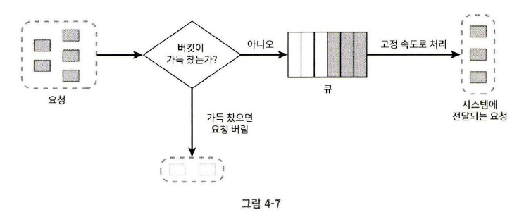

##### 장점

- 큐의 크기가 제한되어 있어 메모리 사용량 측면에서 효율적이다.
- 고정된 처리율을 갖고 있기 때문에 안정적 출력이 필요한 경우 적합하다.

##### 단점

- 단시간에 많은 트래픽이 몰리는 경우 큐에 오래된 요청들이 쌓이고, 쌓인 요청들을 제때 처리하지 못하면 최신 요청들이 버려진다.
- 버킷 크기와 처리율 튜닝이 까다롭다.

#### 고정 윈도 카운터 알고리즘

- 타임라인을 고정된 크기의 윈도(Window)로 나누고, 각 윈도마다 카운터를 붙인다.
- 요청이 접수될 때마다 카운터의 값은 1씩 증가한다.
- 카운터의 값이 임계치에 도달하면 새로운 요청은 새 윈도가 열릴 때까지 버려진다.

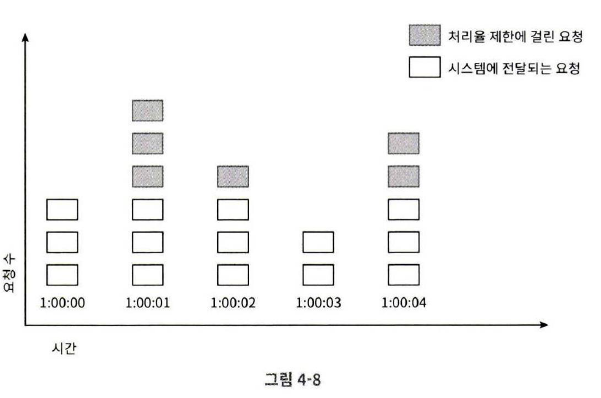

그림에서 타임라인의 시간 단위는 1초다.  
시스템은 초당 3개까지의 요청만을 허용하고, 매초마다 열리는 윈도에 3개 이상의 요청이 들어오면 추가 요청은 버려진다.

이 알고리즘의 문제는 윈도의 경계 부근에 순간적으로 많은 트래픽이 집중될 경우  
윈도에 할당된 양보다 더 많은 요청이 처리될 수 있다는 것이다.

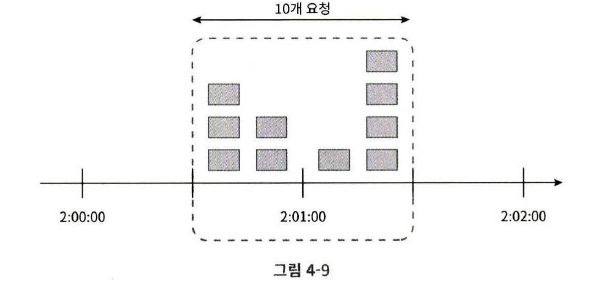

이 예를 보면 2:00:00 ~ 2:01:00에 5개의 요청, 2:01:00 ~ 2:02:00에 5개의 요청이 들어왔다.  
하지만 2:00:30 ~ 2:01:30 사이에 처리된 요청은 10개다. 허용 한도의 2배인 것

##### 장점

- 메모리 효율이 좋다.
- 이해하기 쉽다.
- 윈도가 닫히는 시점에 카운터를 초기화하는 방식은 특정한 트래픽 패턴을 처리하기에 적합하다.

##### 단점

- 윈도 경계 부근에서 일시적으로 많은 트래픽이 몰리는 경우, 기대했던 시스템의 처리 한도보다 많은 양의 요청을 처리하게 된다.

#### 이동 윈도 로깅 알고리즘

고정 윈도 카운터 알고리즘의 문제를 해결

- 요청의 타임스탬프를 추적한다. 타임스탬프 데이터는 보통 레디스의 sorted set 같은 캐시에 저장한다.
- 새 요청이 오면 만료된 타임스탬프는 제거한다. 만료된 타임스탬프는 그 값이 현재 윈도의 시작 시점보다 오래된 타임스탬프를 말한다.
- 새 요청의 타임스탬프를 로그에 추가한다.
- 로그의 크기가 허용치보다 같거나 작으면 요청을 시스템에 전달한다. 그렇지 않으면 처리를 거부한다.

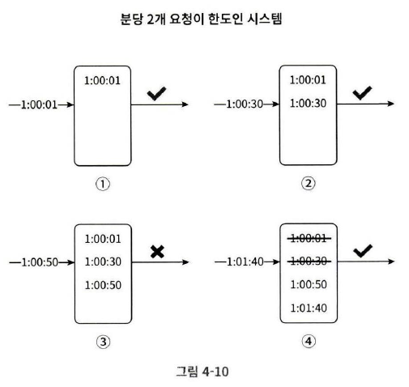

이 그림의 제한기는 분당 최대 2회의 요청을 처리하도록 설정되었다.

- 1:00:01, 1:00:30에 도착한 요청은 처리된다.
- 1:00:50에 도착한 요청은 거부되지만, 타임스탬프는 로그에 남는다.
- 1:01:40에 요청이 도착한다. [1:00:40, 1:01:40) 범위 안에 있는 요청은 1분 윈도 안에 있는 요청이지만, 1:00:40 이전의 타임스탬프는 모두 만료된 값이다. 따라서 1:00:01과 1:00:30을 로그에서 삭제한다.
  삭제 직후 로그의 크기는 2이므로 1:01:40의 신규 요청은 시스템에 전달된다.

##### 장점

- 처리율 제한 메커니즘이 정교하다. 어느 순간의 윈도를 보더라도, 허용되는 요청의 개수는 시스템의 처리율 한도를 넘지 않는다.

##### 단점

- 다량의 메모리를 사용한다.

#### 이동 윈도 카운터 알고리즘

고정 윈도 카운터 알고리즘과 이동 윈도 로깅 알고리즘을 결합한 것이다.

구현에 두 가지 접근법이 사용될 수 있는데, 하나만 설명하고 다른 하나는 참고문헌을 언급하는 정도로 하겠다.

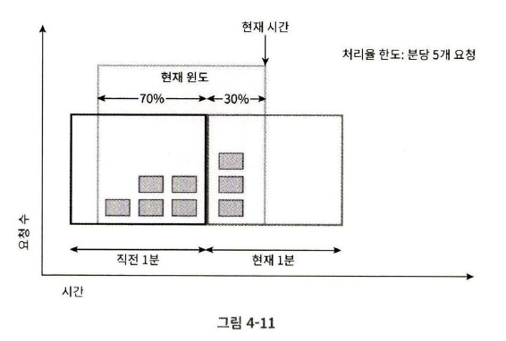

처리율 제한 한도는 분당 7로 설정되어 있다.  
이전 1분 동안 5개의 요청, 현재 1분 동안 3개의 요청이 왔다고 해보자.

현재 1분의 30% 시점에 도착한 새 요청의 경우 현재 윈도에 몇 개의 요청이 온 것으로 보고 처리해야 할까?

- 현재 1분간의 요청 수 + 직전 1분간의 요청 수 \* 이동 윈도와 직전 1분이 겹치는 비율
- 이 공식에 따르면 현재 윈도에 들어 있는 요청은 3 + 5\*70% = 6.5개다. 반올림/내림은 선택할 수 있다.

다른 구현법은 [여기를](https://medium.com/@saisandeepmopuri/system-design-rate-limiter-and-data-modelling-9304b0d18250) 참고

##### 장점

- 이전 시간대의 평균 처리율에 따라 현재 윈도의 상태를 계산하므로 짧은 시간에 몰리는 트래픽에도 잘 대응한다.
- 메모리 효율이 좋다.

###### 단점

- 직접 시간대에 도착한 요청이 균등하게 분포되어 있다고 가정하기 때문에 다소 느슨하다.

### 개략적인 아키텍처

처리율 제한 알고리즘의 기본 아이디어는 얼마나 많은 요청이 접수되었는지를 추적할 수 있는 카운터를 추적 대상별로 두고, 카운터의 값이 한도를 넘어서면 요청을 거부하는 것이다.

카운터는 어디에 보관할까? DB는 디스크 접근 때문에 느려 보통 메모리에서 동작하는 캐시를 사용한다.  
시간에 따른 만료 정책 또한 지원하여 바람직하다.

개략적인 구조와 동작 원리는 다음과 같다.

- 클라이언트가 처리율 제한 미들웨어에 요청을 보낸다.
- 처리율 제한 미들웨어는 캐시의 지정 버킷에서 카운터를 가져와서 한도에 도달했는지 검사한다.
  - 한도에 도달했다면 요청은 거부된다.
  - 한도에 도달하지 않았다면 요청은 API로 전달된다. 한편 미들웨어는 카운터의 값을 증가시킨 후 캐시에 다시 저장한다.

## 3단계 상세 설계

개략적 설계만으로는

- 처리율 제한 규칙은 어떻게 만들어지고 어디에 저장되는가?
- 처리가 제한된 요청들은 어떻게 처리되는가?

를 알 수 없다.

### 처리율 제한 규칙

이런 규칙들은 보통 설정 파일(Configuration File) 형태로 디스크에 저장된다.

### 처리율 한도 초과 트래픽의 처리

어떤 요청이 한도 제한에 걸리면 API는 HTTP 429 응답을 클라이언트에게 보낸다.  
경우에 따라서는 큐에 보관했다가 나중에 처리할 수도 있다.

#### 처리율 제한 장치가 사용하는 HTTP 헤더

클라이언트는 자기 요청이 처리율 제한에 걸리고 있는지, 자기 요청이 처리율 제한에 걸리기까지 얼마나 많은 요청을 보낼 수 있는지 어떻게 알 수 있나?

HTTP 응답 헤더에 관련 정보를 담을 수 있다.

- `X-Ratelimit-Remaining`: 윈도 내에 남은 처리 가능 요청의 수
- `X-Ratelimit-Limit`: 매 윈도마다 클라이언트가 전송할 수 있는 요청의 수
- `X-Ratelimit-Retry-After`: 한도 제한에 걸리지 않으려면 몇 초 뒤에 요청을 다시 보내야 하는 지 알림

사용자가 너무 많은 요청을 보내면 429 에러를 `X-Ratelimit-Retry-After` 헤더와 함께 반환하도록 한다.

### 상세 설계

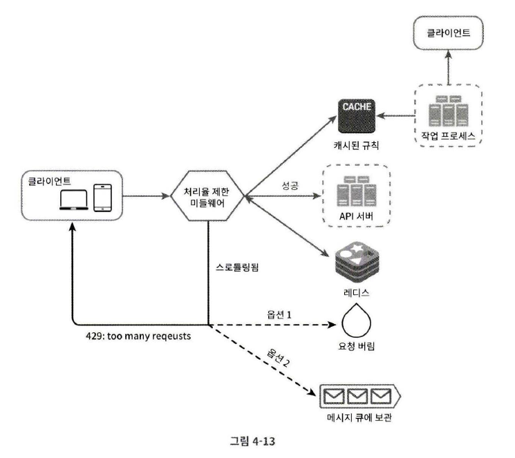

- 처리율 제한 규칙은 디스크에 저장, 작업 프로세스는 수시로 규칙을 디스크에서 읽어 캐시에 저장
- 클라이언트가 요청을 서버에 보내면 요청은 먼저 처리율 제한 미들웨어에 도달
- 처리율 제한 미들웨어는 제한 규칙을 캐시에서 가져온다.  
   카운터 및 마지막 요청의 타임스탬프를 캐시에서 가져온다.  
   가져온 값을 바탕으로
  - 해당 요청이 처리율 제한에 걸리지 않은 경우 API 서버로
  - 해당 요청이 처리율 제한에 걸렸다면 429 too many requests 에러를 클라이언트로 보낸다. 요청은 그대로 버릴 수도, 메세지 큐에 보관할 수도 있다.

### 분산 환경에서의 처리율 제한 장치의 구현

단일 서버에서 동작하는 것이 아닌 여러 대의 서버와 병렬 스레드를 지원하도록 시스템을 확장하려면

경쟁 조건, 동기화 문제를 해결해야 한다.

#### 경쟁 조건

카운터 값을 증가시키는 과정에서 경쟁 조건 이슈가 발생할 수 있다.

경쟁 조건 문제를 해결하는 가장 널리 알려진 해결책을 락인데, 시스템의 성능을 상당히 떨어뜨릴 수가 있다.

위 설계의 경우 루아 스크립트(Lua Script) 또는 레디스 자료구조 중 sorted set을 사용하면 해결 가능하다.

루아 스크립트는 레디스 내부에서 실행되는 작은 스크립트 언어인데,  
이를 이용하면 여러 커맨드를 묶어서 하나의 트랜잭션처럼 실행할 수 있다.

sorted set을 이용할 경우 ZADD, ZREMRANGEBYSCORE, ZCARD 같은 단일 명령어로 원자성 보장이 가능하다.

#### 동기화 이슈

수백만 사용자를 지원하려면 한 대의 처리율 제한 장치 서버로는 충분하지 않을 수 있다.  
그래서 처리율 제한 장치 서버를 여러 대 두게 되면 동기화가 필요해진다.

웹 계층은 무상태 이므로 클라이언트는 다음 요청을 각기 다른 제한 장치로 보내게 될 수 있다.

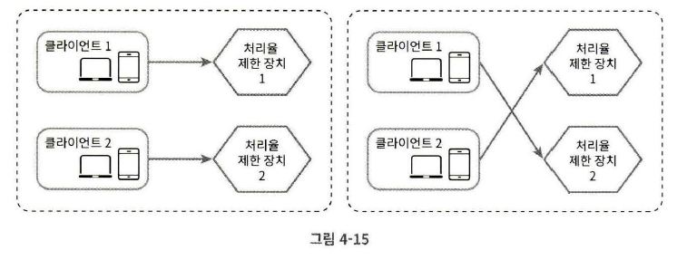

한 가지 해결책은 고정 세션(Sticky Session)을 활용하여 같은 클라이언트로부터의 요청은 항상 같은 처리율 제한 장치로 보낼 수 있도록 하는 것인데, 이 방법은 확장 가능하지도 않고 유연하지도 않아 추천되지 않는다.

더 나은 방법은 중앙 집중형 데이터 저장소를 쓰는 것이다.

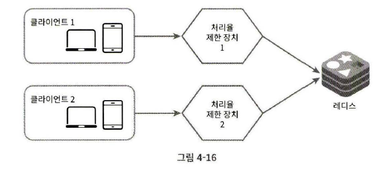

#### 성능 최적화

데이터센터에서 멀리 떨어진 사용자의 지연 시간을 줄이기 위해 지역적으로 분산된 위치에 에지 서버를 설치

제한 장치 간 데이터 동기화 시에 최종 일관성 모델(Eventual Consistency Model)을 사용해야 한다.

#### 모니터링

채택된 처리율 제한 알고리즘이 효과적인지, 정의한 처리율 제한 규칙이 효과적인지 판단하기 위해 데이털르 모을 필요가 있다.

## 4단계 마무리

다룬 알고리즘은 다음과 같다.

- 토큰 버킷
- 누출 버킷
- 고정 윈도 카운터
- 이동 윈도 로그
- 이동 윈도 카운터

알고리즘 외에도 알고리즘을 구현하는 아키텍처, 분산환경에서의 처리율 제한 장치, 성능 최적화와 모니터링 등의 주제를 살펴보았다.

시간이 허락한다면 다음과 같은 부분을 언급하면 좋다.

- 경성 또는 연성 처리율 제한

  - 경성 처리율 제한: 요청의 개수는 임계치를 절대 넘어설 수 없다.
  - 연성 처리율 제한: 요청 개수는 잠시 동안 임계치를 넘어설 수 있다.

- 다양한 계층에서의 처리율 제한

  애플리케이션 계층(HTTP)에서만 살펴보았는데, Iptables를 사용하면 IP 주소에 처리율 제한을 적용한느 것이 가능하다.

- 처리율 제한을 회피하는 방법
  - 클라이언트 측 캐시를 사용하여 API 호출 횟수를 줄인다.
  - 처리율 제한의 임계치를 이해하고, 짧은 시간 동안 너무 많은 메시지를 보내지 않도록 한다.
  - 예외나 에러를 처리하는 코드를 도입하여 클라이언트가 예외적 상황으로부터 복구될 수 있도록 한다.
  - 재시도 로직을 구현할 때는 충분한 백오프(Back-Off) 시간을 둔다.
