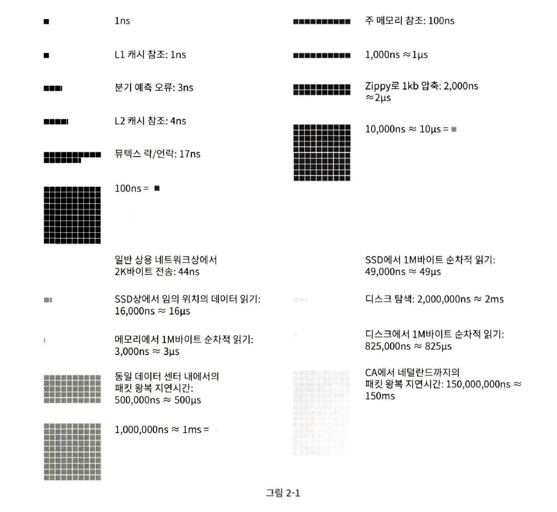

# 02장 개략적인 규모 추정

시스템 설계 면접을 볼 때, 시스템 용량이나 성능 요구사항을 개략적으로 추정해보라는 요구를 받을 수도 있다.

구글의 시니어 펠로(Senior Fellow) 제프 딘(Jeff Dean)에 따르면, “개략적인 규모 추정(Back-of-the-Envelope Estimation)은 보편적으로 통용되는 성능 수치 상에서 사고 실험을 행하여 추정치를 계산하는 행위로서, 어떤 설계가 요구사항에 부합할 것인지 보기 위한 것” 이다.

개략적 규모 추정을 효과적으로 해 내려면 규모 확장성을 표현하는 데 필요한 수치들(2의 제곱수, 응답지연, 가용성에 관한 수치들)을 잘 이해하고 있어야 한다.

## 2의 제곱수

분산 시스템에서 다루는 데이터 양은 엄청나게 커질 수 있으나 그 계산법은 기본을 크게 벗어나지 않는다.

제대로 된 계산 결과를 얻으려면 데이터 볼륨의 단위를 2의 제곱수로 표현하면 어떻게 되는지를 우선 알아야 한다.

최소 단위는 1바이트(8비트), ASCII 문자 하나가 차지하는 메모리 크기 1바이트

| 2의 x 제곱 | 근사치               | 이름                   | 축약형 |
| ---------- | -------------------- | ---------------------- | ------ |
| 10         | 1천 (thousand)       | 1킬로바이트 (Kilobyte) | 1KB    |
| 20         | 1백만 (million)      | 1메가바이트 (Megabyte) | 1MB    |
| 30         | 10억 (billion)       | 1기가바이트 (Gigabyte) | 1GB    |
| 40         | 1조 (trillion)       | 1테라바이트 (Terabyte) | 1TB    |
| 50         | 1000조 (quadrillion) | 1페타바이트 (Petabyte) | 1PB    |

## 모든 프로그래머가 알아야 하는 응답지연 값

구글의 제프 딘은 2010년에 통상적인 컴퓨터에서 구현된 연산들의 응답지연 값을 공개한 바 있다.

이들 가운데 몇몇은 더 빠른 컴퓨터가 등장하여 더 이상 유효하지 않게 되었지만, 아직 이 수치들은 컴퓨터 연산들의 처리 속도가 어느 정도인지 대략적으로 짐작할 수 있도록 해준다.

| 연산명                                            | 시간                  |
| ------------------------------------------------- | --------------------- |
| L1 캐시 참조                                      | 0.5ns                 |
| 분기 예측 오류 (branch mispredict)                | 5ns                   |
| L2 캐시 참조                                      | 7ns                   |
| 뮤텍스(mutex) 락/언락                             | 100ns                 |
| 주 메모리 참조                                    | 100ns                 |
| Zippy로 1 KB 압축                                 | 10,000ns = 10μs       |
| 1 Gbps 네트워크로 2 KB 전송                       | 20,000ns = 10μs       |
| 메모리에서 1 MB 순차적으로 read                   | 250,000ns = 250μs     |
| 같은 데이터 센터 내에서의 메시지 왕복 지연시간    | 500,000ns = 500μs     |
| 디스크 탐색 (seek)                                | 10,000,000ns = 10ms   |
| 네트워크에서 1 MB 순차적으로 read                 | 10,000,000ns = 10ms   |
| 디스크에서 1 MB 순차적으로 read                   | 30,000,000ns = 30ms   |
| 한 패킷의 CA(캘리포니아) → 네덜란드 왕복 지연시간 | 150,000,000ns = 150ms |

💡 단위 정리:

- `ns` = 나노초 (10⁻⁹초)
- `μs` = 마이크로초 (10⁻⁶초 = 1,000ns)
- `ms` = 밀리초 (10⁻³초 = 1,000,000ns)

딘 박사가 나열한 이 수들을 시각화하기 위해, 한 구글 엔지니어가 개발한 도구가 있다.

그림 2-1은 이 도구를 사용하여 2020년 기준으로 시각화한 수치이다.

그림 2-1에 제시된 수치들을 분석하면

- 메모리는 빠르지만 디스크는 아직 느리다.
- 디스크 탐색(Seek)은 가능한 한 피하라.
- 단순한 압축 알고리즘은 빠르다.
- 데이터를 인터넷으로 전송하기 전에 가능하면 압축하라.
- 데이터 센터는 보통 여러 지역(Region)에 분산되어 있고, 센터들 간에 데이터를 주고 받는 데는 시간이 걸린다.

## 가용성에 관계된 수치들

고가용성(High Availability)은 시스템이 오랜 시간 동안 지속적으로 중단 없이 운영될 수 있는 능력을 지칭하는 용어다.

고가용성을 표현하는 값은 퍼센트로 표현하는데, 100%는 시스템이 단 한 번도 중단된 적이 없었음을 의미한다.

대부분의 서비스는 99%에서 100% 사이의 값을 갖는다.

SLA(Service Level Agreement)는 서비스 사업자(Service Provider)가 보편적으로 사용하는 용어로, 서비스 사업자와 고객 사이에 맺어진 합의를 의미한다.

이 합의에는 서비스 사업자가 제공하는 서비스의 가용시간(Uptime)이 공식적으로 기술되어 있다.

아마존, 구글, 마이크로소프트 같은 사업자는 99% 이상의 SLA를 제공한다.

가용시간은 관습적으로 숫자 9를 사용해 표시한다. 9가 많으면 많을수록 좋다고 보면 된다.

| 가용률   | 하루당 장애시간 | 주당 장애시간 | 개월당 장애시간 | 연간 장애시간 |
| -------- | --------------- | ------------- | --------------- | ------------- |
| 99%      | 14.40분         | 1.68시간      | 7.31시간        | 3.65일        |
| 99.9%    | 1.44분          | 10.08분       | 43.83분         | 8.77시간      |
| 99.99%   | 8.64초          | 1.01분        | 4.38분          | 52.60분       |
| 99.999%  | 864.00밀리초    | 6.05초        | 26.30초         | 5.26분        |
| 99.9999% | 86.40밀리초     | 604.80밀리초  | 2.63초          | 31.56초       |

## 예제: 트위터 QPS와 저장소 요구량 추정

제시된 수치들은 연습용이며, 트위터의 실제 성능이나 요구 사항과는 아무 관계가 없다…!

### 가정

- 월간 능동 사용자(Monthly Active User)는 3억(300 million) 명이다.
- 50%의 사용자가 트위터를 매일 사용한다.
- 평균적으로 각 사용자는 매일 2건의 트윗을 올린다.
- 미디어를 포함하는 트윗은 10% 정도다.
- 데이터는 5년간 보관된다.

### 추정

QPS(Query Per Second) 추정치

- 일간 능동 사용자(Daily Active User, DAU) = 3억 \* 50% = 1.5 억
- QPS = 1.5억 \* 2 트윗 / 24시간 / 3600초 = 약 3500
- 최대 QPS(Peek QPS) = 2 \* QPS = 약 7000

미디어 저장을 위한 저장소 요구량

- 평균 트윗 크기
  - tweet_id 에 64바이트
  - 텍스트에 140바이트
  - 미디어에 1MB
- 미디어 저장소 요구량: 1.5억 _ 2 _ 10% \* 1MB = 30TB/일
- 5년간 미디어를 보관하기 위한 저장소 요구량: 30TB _ 365 _ 5 = 약 55PB

## 팁

개략적인 규모 추정과 관계된 면접에서 가장 중요한 것은 문제를 풀어가는 절차이다.

올바른 절차를 밟느냐가 결과를 내는 것보다 중요하다.

면접자가 보고 싶어하는 것은 여러분의 문제 해결 능력일 것이다.

- 근사치를 활용한 계산(Rounding and Approximation): 면접장에서 복잡한 계산을 하는 것은 어려운 일이다.
  이런 데 시간을 쓰는 것은 낭비다.
  적절한 근사치를 활용하여 시간을 절약하자.
- 가정(Assumption)들은 적어 두라. 나중에 살펴볼 수 있도록
- 단위(Unit)를 붙여라. 5라고만 적으면 5KB인지 5MB인지 알 수가 없다.
- 많이 출제되는 개략적 규모 추정 문제는 QPS, 최대 QPS, 저장소 요구량, 캐시 요구량, 서버 수 등을 추정하는 것이다. 이런 값들을 계산하는 연습을 미리 하도록 하자.
