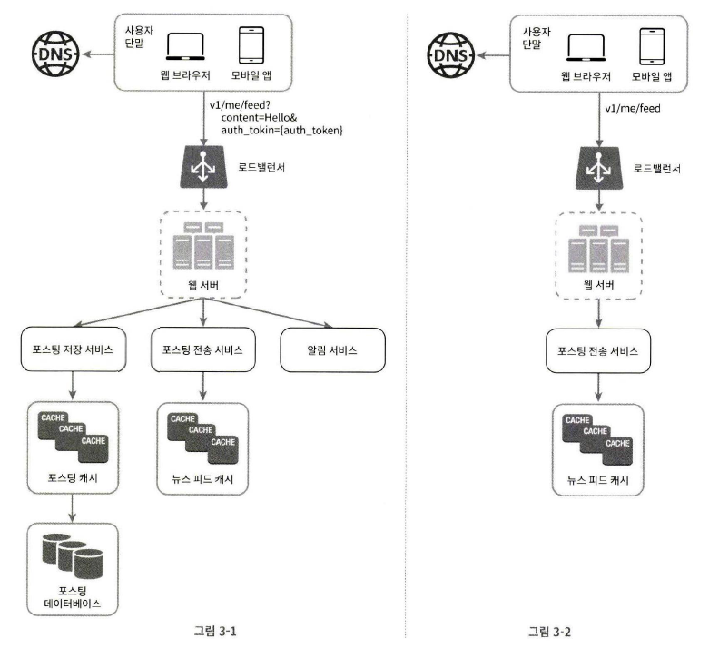
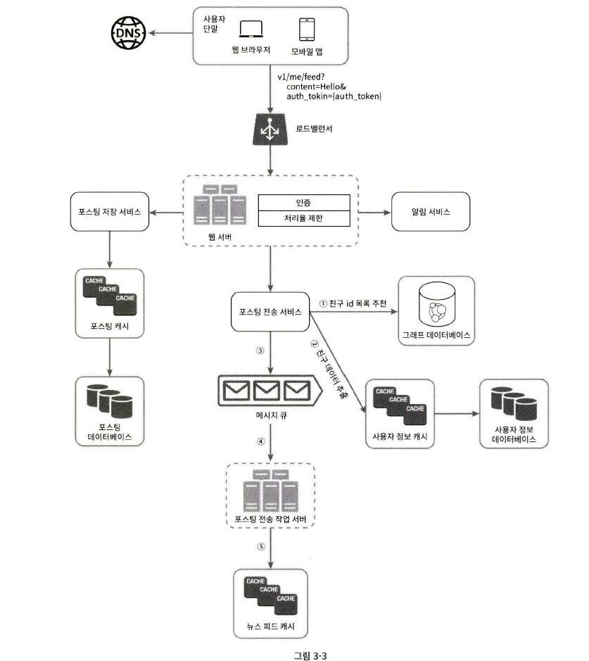
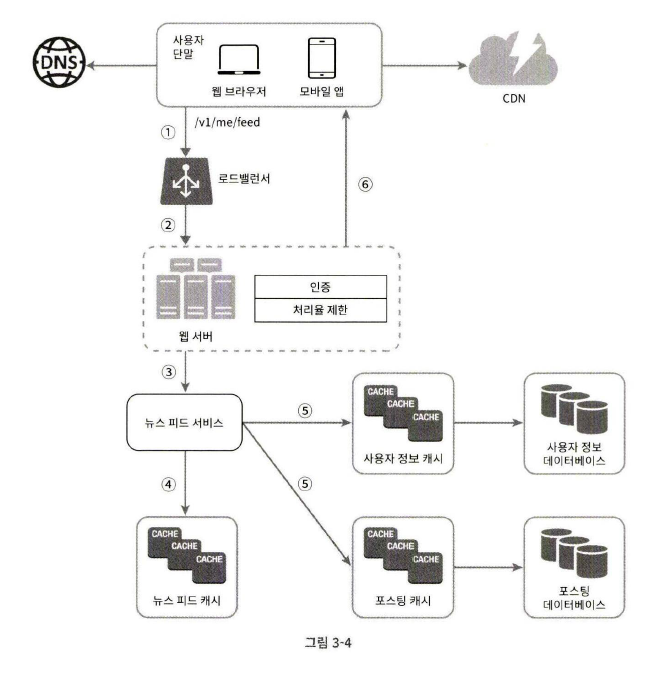

# 03장 시스템 설계 면접 공략법

시스템 설계 면접은 당황스러울 때가 많다.

“널리 알려진 제품 xxx를 설계해보라” 라는 식으로 막연한 문제가 나올 때도 있다.

이런 질문들은 모호하고, 범위도 지나치게 넓다. 여러분이 불편하게 느끼는 것도 당연하다.

수백 명, 수천 명의 엔지니어들이 참여하여 개발한 제품을 어떻게 한 시간 안에 설게한단 말인가????

다행히도, 아무도 여러분에게 이런 시스템을 아주 세밀하게 설계하라는 요구를 않을 것이라는 점이다.

실세계에서 이용되는 시스템의 구조는 극도로 복잡하다. 그런 시스템을 한 사람이 설계할 수 있으리라 아무도 기대하지 않는다.

시스템 설계 면접은 모호한 문제를 풀기 위해 해결책을 찾아내는 과정에 대한 시뮬레이션이다.

문제에는 정해진 결말도 없고, 정답도 없다.

최종적으로 도출될 설계안은 여러분이 설계 과정에 들인 노력에 비하면 그다지 중요하지 않다.

이 면접은 여러분의 설계 기술을 시연하는 자리이고, 설계 과정에서 내린 결정들에 대한 방어 능력을 보이는 자리이며, 면접관의 피드백을 건설적인 방식으로 처리할 자질이 있음을 보이는 자리인 것이다.

시스템 설계 면접은 지원자의 설계 능력의 기술적 측면 뿐만 아니라 지원자가 협력에 적합한 사람인지, 압박이 심한 상황도 잘 헤쳐 나갈 자질이 있는지, 모호한 문제를 건설적으로 해결할 능력이 있는지 등을 살펴볼 수 있다.

좋은 질문을 던질 능력이 있는지도 중요하다.

한편, 설계의 순수성에 집착한 나머지, Trade-Off를 도외시하고 과도한 엔지니어링(Over-Engineering)을 하지는 않는지도 면접관은 평가할 것이다.

## 효과적 면접을 위한 4단계 접근법

### 1단계: 문제 이해 및 설계 범위 확정

시스템 설계 면접에서 생각 없이 바로 답을 내서는 좋은 점수를 받기 어렵다.

요구사항을 완전히 이해하지 않고 답을 내놓는 행위는 아주 엄청난 부정적 신호다.

깊이 생각하고 질문하여 요구사항과 가정들을 분명히 하라.

엔지니어인 우리에게는 어려운 문제를 풀고 최종 설계를 바로 내놓고 싶은 욕구가 있다.

하지만 그러면 잘못된 시스템을 설계할 가능성이 높아진다.

엔지니어가 가져야 할 가장 중요한 기술 중 하나는 올바른 질문을 하는 것, 적절한 가정을 하는 것, 그리고 시스템 구축에 필요한 정보를 모으는 것이다.

요구사항을 정확히 이해하는 데 필요한 질문을 하라.

- 구체적으로 어떤 기능들을 만들어야 하나?
- 제품 사용자 수는 얼마나 되나?
- 회사의 규모는 얼마나 빨리 커지리라 예상하나? 3달, 6달, 1년 뒤의 규모는 얼마가 되리라 예상하는가?
- 회사가 주로 사용하는 기술 스택은 무엇인가? 설계를 단순화하기 위해 활용할 수 있는 기존 서비스로는 어떤 것들이 있는가?

#### 예제

뉴스 피드 시스템을 설계하라는 요구를 받았다.

요구사항을 분명히 하기 위한 질문을 던져야 할 것이다.

1. 모바일 앱과 웹 앱 가운데 어느 쪽을 지원해야 하나요? 둘 다 일까요?
   - 둘 다 입니다.
2. 가장 중요한 기능은 무엇인가요?
   - 새로운 포스트를 올리고, 다른 친구의 뉴스 피드를 볼 수 있도록 해야 합니다.
3. 뉴스 피드는 시간 역순으로 정렬되어야 하나요? 특별한 정렬 기준이 있나요?

   가까운 친구의 포스트가 사용자 그룹에 올라가는 포스트보다 중요하다거나.

   - 문제를 단순하게 하기 위해, 일단 시간 역순으로 정렬된다고 가정합시다.

4. 한 사용자는 최대 몇 명의 사용자와 친구를 맺을 수 있나요?
   - 5000명입니다.
5. 사이트로 오는 트래픽 규모는 어느 정도입니까?
   - 일간 능동 사용자(Daily Active User, DAU)는 천만 명입니다.
6. 피드에 이미지나 비디오도 올라올 수 있나요?
   - 이미지나 비디오 같은 미디어 파일도 포스트 할 수 있어야 합니다.

### 2단계: 개략적인 설계안 제시 및 동의 구하기

개략적인 설계안을 제시하고 면접관의 동의를 얻어야 한다.

면접관과 협력하며 진행하면 좋다.

- 설계안에 대한 최초 청사진을 제시하고 의견을 구하라.
  면접관을 마치 팀원인 것처럼 대하라.
  훌륭한 면접관들은 지원자들과 대화하고 설계 과정에 개입하기를 즐긴다.
- 화이트보드나 종이에 핵심 컴포넌트를 포함하는 다이어그램을 그려라.
  클라이언트(모바일/웹), API, 웹 서버, 데이터 저장소, 캐시, CDN, 메시지 큐 같은 것들이 포함될 수 있을 것이다.
- 이 최초 설계안이 시스템 규모에 관계된 제약 사항들을 만족하는지를 개략적으로 계산해보라.
  계산 과정은 소리 내어 설명하라.
  이런 개략적 추정이 필요한지는 면접관에게 미리 물어보도록 하자.

#### 예제

뉴스 피드 시스템 설계 요구를 이어가보자.

개략적으로 보자면 이 설계는 두 가지 처리 flow로 나눠 생각할 수 있다.

피드 발행(Feed Publishing)과 피드 생성(Feed Building)

- 피드 발행: 사용자가 포스트를 올리면 관련된 데이터가 캐시/데이터베이스에 기록되고, 해당 사용자의 친구 뉴스 피드에 뜨게 된다.
- 피드 생성: 어떤 사용자의 뉴스 피드는 해당 사용자 친구들의 포스트를 시간 역순으로 정렬하여 만들어진다.

### 3단계: 상세 설계

이 단계로 왔다면 다음 목표는 완료한 상태일 것이다.

- 시스템에서 전반적으로 달성해야 할 목표와 기능 범위 확인
- 전체 설계의 개략적 청사진 마련
- 해당 청사진에 대한 면접관의 의견 청취
- 상세 설계에서 집중해야 할 영역들 확인

이제 면접관과 해야 할 일은 면접 시간 동안 어떤 컴포넌트를 집중해서 설명할지 정하는 것이다.

어떤 면접에서는 시스템의 성능 특성에 대한 질문을 받을 수도 있고, 대부분의 경우 면접관은 특정 시스템 컴포넌트들의 세부사항을 깊이 있게 설명하기를 원한다.

예를 들어 출제된 문제가 단축 URL 생성기 설계였다면, 면접관은 여러분이 그 해시 함수의 설계를 구체적으로 설명하는 것을 듣고 싶어할 것이다.

채팅 시스템에 관한 문제였다면, 어떻게 하면 지연시간을 줄이고, 사용자의 온/오프라인 상태를 표시할 것인지를 듣고자 할 것이다.

불필요한 세부사항을 설명하는 데에 시간을 쓰지 말라. 여러분은 면접관에게 긍정적 신호를 전달하는 데 집중해야 한다.

예를 들어 페이스북에서 뉴스 피드의 순위를 매기는 데 사용되는 `EdgeRank` 알고리즘에 대해 이야기하는 것은 바람직하지 않은데, 시간을 너무 많이 쓰게 될 뿐만 아니라 여러분이 규모 확장 가능한 시스템을 설계할 능력이 있다는 것을 입증하는 데는 도움이 되지 않기 때문이다.

#### 예제

뉴스 피드 시스템의 개략적 설계를 마친 상황이라 해보자.

면접관도 만족하고 있다.

이제 두 가지 flow를 보다 깊이 탐구해야 한다.

1. 피드 발행
2. 뉴스 피드 가져오기

## 4단계: 마무리

면접관은 설계 결과물에 관련된 몇 가지 후속 질문을 던질 수도 있고(Follow-Up Questions), 여러분 스스로 추가 논의를 진행하도록 할 수도 있다.

- 면접관이 시스템 병목 구간, 혹은 좀 더 개선 가능한 지점을 찾아내라 주문할 수 있다.
  여러분의 설계가 완벽하다거나 개선할 부분이 없다는 답은 하지 않도록 하자.
  여러분의 비판적 사고 능력을 보이고, 마지막으로 좋은 인상을 남길 기회다.
- 여러분이 만든 설계를 한번 다시 요약해주는 것도 도움이 될 수 있다.
  여러 해결책을 제시한 경우에는 특히 중요하다.
- 오류가 발생하면 무슨일이 생기는지(서버 오류, 네트워크 장애 등) 따져보면 흥미로울 것이다.
- 운영 이슈도 논의할 가치가 충분하다.
  메트릭은 어떻게 수집하고 모니터링 할 것인가? 로그는? 시스템은 어떻게 배포해 나갈 것인가?
- 미래에 닥칠 규모 확장 요구에 어떻게 대처할 것인지도 흥미로운 주제다.
- 시간이 좀 남았다면, 필요하지만 다루지 못했던 세부적 개선 사항들을 제안할 수 있다.

## 정리

### 해야 할 것

- 질문을 통해 확인하라: 스스로 내린 가정이 옳다 믿고 진행하지 말라
- 문제의 요구사항을 이해하라.
- 정답이나 최선의 답안 같은 것은 없다는 점을 명심하라.
- 면접관이 여러분의 사고 흐름을 이해할 수 있도록 하라. 면접관과 소통하라.
- 가능하다면 여러 해법을 함께 제시하라.
- 개략적 설계에 면접관이 동의하면, 각 컴포넌트의 세부사항을 설명하기 시작하라.
  가장 중요한 컴포넌트부터.
- 면접관의 아이디어를 이끌어 내라.
  좋은 면접관은 여러분과 같은 팀원처럼 협력한다.
- 포기하지 말라.

### 하지 말아야 할 것

- 전형적인 면접 문제들에도 대비하지 않은 상태에서 면접장에 가지 말라.
- 요구사항이나 가정들을 분명히 하지 않은 상태에서 설계를 제시하지 말라.
- 처음부터 특정 컴포넌트의 세부사항을 너무 깊게 설명하지 말라.
  개략적인 설계를 마친 후에 세부사항으로 나아가라.
- 진행 중에 막혔다면, 힌트를 청하기를 주저하지 말라.
- 다시 말하지만, 소통을 주저하지 말라. 침묵 속에 설계를 진행하지 말라.
- 설계안을 내놓는 순간 면접이 끝난다고 생각 말라.
  의견을 일찍, 그리고 자주 구하라.

### 시간 배분

시스템 설계 면접은 보통 매우 광범위한 영역을 다루며, 45분 혹은 한 시간은 충분하지 않을 수 있다.

45분의 시간이 주어진다고 가정하고, 아래에 대략적으로 정리했다.

1단계 - 문제 이해 및 설계 범위 확정: 3~10분

2단계 - 개략적 설계안 제시 및 동의 구하기: 10~15분

3단계 - 상세 설계: 10~25분

4단계 - 마무리: 3~5분
