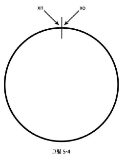

# 5장 안정 해시 설계

## 해시 키 재배치(Rehash) 문제

N개의 캐시 서버가 있을 때 부하를 균등하게 나누는 보편적 방법은

serverIndex = hash(key) % N

이 방법은 서버 풀의 크기가 고정되어 있을 때, 데이터 분포가 균등할 때는 잘 동작한다.  
하지만 서버가 추가되거나 기존 서버가 삭제되면 문제가 생긴다.

1번 서버가 죽으면 대부분 캐시 클라이언트가 데이터가 없는 엉뚱한 서버에 접속하게 된다는 뜻이다.

## 안정 해시

안정 해시(Consistent Hash)는 해시 테이블 크기가 조정될 때 평균적으로 오직 k/n개의 키만 재배치하는 해시 기술이다. (k: 키의 개수, n: 슬롯의 개수)

### 해시 공간과 해시 링

해시 함수 f의 출력 값 범위를 $x_0, x_1, ···, x_n$ 이라고 하고,  
f로 SHA-1을 사용하자.  
SHA-1의 해시 공간(Hash Space) 범위는 0 ~ $2^{160} - 1$까지라고 알려져있다.

따라서 $x_0 = 0, x_n = 2^{160}-1$이 된다.

이 해시 공간의 양쪽을 구부려 접으면 해시 링(Hash Ring)이 만들어진다.

### 해시 서버

해시 함수 f를 사용하면 서버 IP나 이름을 이 링 위의 위치에 대응시킬 수 있다.

그림은 4개의 서버를 이 해시 링 위에 배치한 결과다.

### 해시 키

캐시할 키 key0, key1, key2, key3 또한 해시 링 위의 어느 지점에 배치할 수 있다.

여기 사용된 해시 함수는 modular 연산은 사용하지 않고 있다.

### 서버 조회

어떤 키가 저장되는 서버는, 해당 키의 위치로부터 시계 방향으로 링을 탐색해 나가면서 만나는 첫 번째 서버다.

따라서 key0은 서버 0에 저장되고, key1은 서버 1에 저장되며, key2는 서버 2에, key3은 서버 3에 저장된다.

### 서버 추가

안정 해시이므로, 서버를 추가하더라도 키 가운데 일부만 재배치하면 된다.

그림을 보면, 서버 4가 추가된 뒤 key0만 재배치된 것을 확인할 수 있다.  
다른 키들은 재배치되지 않는다.

### 서버 제거

마찬가지로 하나의 서버가 제거되면 키 가운데 일부만 재배치된다.

### 기본 구현법의 두 가지 문제

안정 해시 알고리즘의 기본 절차는

- 서버와 키를 균등 분포(Uniform Distribution) 해시 함수를 사용해 해시 링에 배치
- 키의 위치에서 링을 시계 방향으로 탐색하다 만나는 최초의 서버를 키가 저장될 서버로 지정

이 접근법에서 발생하는 문제는 다음과 같다.

서버가 추가되거나 삭제되는 상황을 감안했을 때, 파티션의 크기를 균등하게 유지하는 것이 불가능하다.  
여기서 파티션이란 인접한 서버 사이의 해시 공간이다.

그림은 s1이 삭제되어 s2가 다른 서버들의 파티션 대비 거의 두 배의 파티션을 할당받는 상황을 보여준다.

두 번째 문제는 키의 균등 분포(Uniform Distribution)를 달성하기 어렵다는 것이다.

서버 1과 서버 3은 아무 데이터도 갖지 않는 반면, 대부분의 키는 서버 2에 보관될 것이다.  
이 문제를 해결하기 위해 가상 노드(Virtual Node) 또는 복제(Replica)라는 기법이 사용된다.

### 가상 노드

가상 노드(Virtual Node)는 실제 노드 또는 서버를 가리키는 노드로, 하나의 서버는 여러 개의 가상 노드를 가질 수 있다.

그림에서 서버 0과 서버 1은 3개의 가상 노드를 갖는다.

키의 위치로부터 시계 방향으로 링을 탐색하다 만나는 최초의 가상 노드가 해당 키가 저장될 서버가 된다.

가상 노드의 수를 늘리면 키의 분포는 점점 더 균등해진다.  
그러나 가상 노드 데이터를 저장할 공간은 더 많이 필요하게 될 것이다.  
시스템 요구사항에 맞도록 가상 노드 개수를 적절히 조절해야 한다.

### 재배치할 키 결정

서버가 추가되거나 제거되면 데이터 일부는 재배치해야 한다.

그림처럼 서버 4가 추가되면 이에 영향 받는 범위는 s4부터 반시계 방향에 있는 첫 번째 서버 s3까지다.  
s3 ~ s4 사이에 있는 키들을 s4로 재배치해야 한다.

그림과 같이 s1이 삭제되면 s1부터 반시계 방향에 있는 첫 번째 서버 s0 사이에 있는 키들이 s2로 재배치되어야 한다.

## 마치며

안정 해시가 왜 필요하고, 어떻게 동작하는지 살펴보았다.

안정 해시의 이점

- 서버가 추가되거나 삭제될 때 재배치되는 키의 수가 최소화된다.
- 데이터가 보다 균등하게 분포되므로 수평적 규모 확장성을 달성하기 쉽다.
- 핫스팟 키 문제를 줄인다. 특정한 샤드에 대한 접근이 지나치게 빈번하면 서버 과부하 문제가 생길 수 있다.
