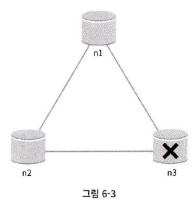
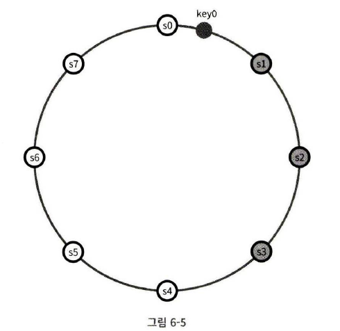
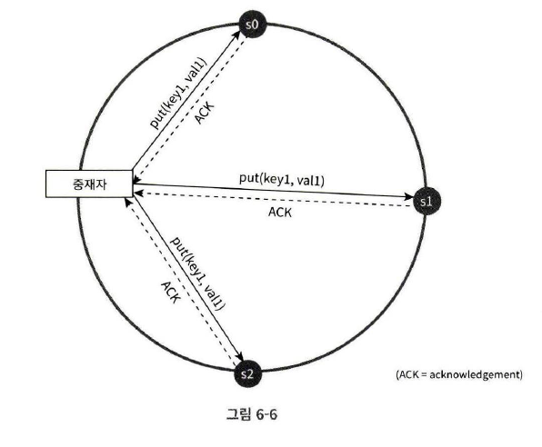
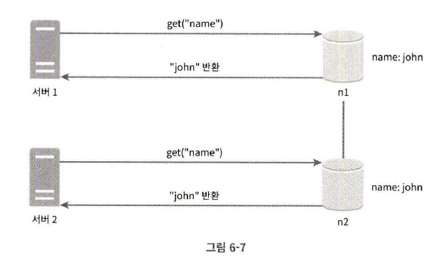
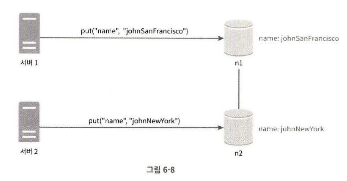
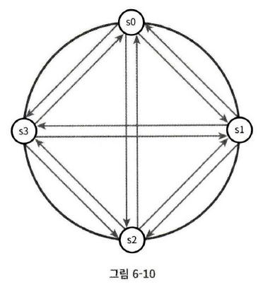

# 06장 키-값 저장소 설계

키-값 저장소(Key-Value Store)는 비 관계형 데이터베이스이다.

키-값 쌍에서 키는 유일해야 하며, 해당 키에 매달린 값은 키를 통해서만 접근할 수 있다.  
성능상의 이유로, 키의 길이는 짧을수록 좋다.

다음은 키-값 저장소에 보관된 데이터의 사례다.

| 키  | 값    |
| --- | ----- |
| 145 | john  |
| 147 | bob   |
| 160 | julia |

키-값 저장소를 설계해보자.

- put(key, value)
- get(key)

## 문제 이해 및 설계 범위 확정

읽기, 쓰기, 메모리 사용량 사이의 균형을 찾고,  
데이터 일관성과 가용성 사이에 타협적 결정을 내린 설계를 만들었다면 쓸만한 답안일 것이다.

다음 특성을 갖는 저장소를 설계해보자.

- 키-값 쌍의 크기는 10KB 이하이다.
- 큰 데이터를 저장할 수 있어야 한다.
- 높은 가용성을 제공해야 한다.
- 높은 규모 확장성을 제공해야 한다. 트래픽 양에 따라 자동적으로 서버 증설/삭제 가능
- 데이터 일관성 수준은 조정이 가능해야 한다.
- 응답 지연시간이 짧아야 한다.

## 단일 서버 키-값 저장소

가장 쉬운 방법은 키-값 쌍 전부를 메모리에 해시 테이블로 저장하는 것이다.  
빠른 속도를 보장하지만 모든 데이터를 메모리 안에 두는 것은 불가능할 수 있다.

이 문제를 해결하기 위해 데이터 압축, 자주 쓰이는 데이터만 메모리에 두고 나머지는 디스크에 저장 하는 방법 등을 사용할 수 있다.

하지만 곧 한 대 서버로는 부족해질 것이다.

## 분산 키-값 저장소

### CAP 정리

데이터 일관성(Consistency), 가용성(Availability), 파티션 감내성(Partition Tolerance)라는 세 가지 요구사항을 동시에 만족하는 분산 시스템을 설계하는 것은 불가능하다는 정리다.

- 데이터 일관성:

  분산 시스템에 접속하는 모든 클라이언트는 어떤 노드에 접속했느냐에 관계 없이 항상 같은 데이터를 보게 되어야 한다.

- 가용성:

  분산 시스템에 접속하는 클라이언트는 일부 노드에 장애가 발생하더라도 항상 응답을 받을 수 있어야 한다.

- 파티션 감내:

  파티션은 두 노드 사이에 통신 장애가 발생하였음을 의미한다.  
   파티션 감내는 네트워크에 파티션이 생기더라도 시스템은 정상 동작해야 한다는 것을 의미한다.

CAP 정리는 이들 가운데 두 가지를 충족시키려면 다른 하나는 반드시 포기해야 한다는 것을 뜻한다.

키-값 저장소는 어느 두 가지를 만족하느냐에 따라 다음과 같이 분류할 수 있다.

- CP 시스템
- AP 시스템
- CA 시스템

  그러나 통상 네트워크 장애는 피할 수 없는 일로 여겨지므로, 분산 시스템은 반드시 파티션 문제를 감내할 수 있도록 설계되어야 한다.

  그러므로 실세계에서 CA 시스템은 존재하지 않는다.

---

분산 시스템에서 데이터는 보통 여러 노드에 복제되어 보관된다.

세 대의 replica 노드 n1, n2, n3에 데이터를 복제하여 보관하는 상황을 가정

### 이상적 상태

이상적 환경이라면 네트워크가 파티션되는 상황은 일어나지 않을 것이다.

n1에 기록된 데이터는 자동적으로 n2와 n3에 복제되어 데이터 일관성과 가용성도 만족한다.

### 실세계의 분산 시스템

분산 시스템은 파티션 문제를 피할 수 없다.  
파티션 문제가 발생하면 일관성과 가용성 사이에서 하나를 선택해야 한다.

n3에 장애가 발생하여 n1 및 n2와 통신할 수 없는 상황

클라이언트가 n1 또는 n2에 기록한 데이터는 n3에 전달되지 않는다.  
n3에 기록되었으나 아직 n1, n2에 전달되지 않은 데이터가 있디면 n1, n2는 오래된 사본을 갖고 있을 것이다.

가용성 대신 일관성을 선택한다면(CP 시스템) 세 서버 사이에 생길 수 있는 데이터 불일치 문제를 피하기 위해 n1과 n2에 대해 쓰기 연산을 중단시켜야 하는데, 그렇게 하면 가용성이 깨진다.

네트워크 파티션 때문에 일관성이 깨질 수 있는 상황이 발생하면 이런 시스템은 장애가 해결될 때까지 오류를 반환해야 한다.

하지만 일관성 대신 가용성을 선택한 시스템(AP 시스템)은 낡은 데이터를 반환할 위험이 있더라도 계속 읽기 연산을 허용해야 한다.

### 시스템 컴포넌트

키-값 저장소 구현에 사용할 핵심 컴포넌트 및 기술

- 데이터 파티션
- 데이터 다중화(Replication)
- 일관성(Consistency)
- 일관성 불일치 해소(Inconsistency Resolution)
- 장애 처리
- 시스템 아키텍처 다이어그램
- 쓰기 경로(Write Path)
- 읽기 경로(Read Path)

다이나모(Dynamo), 카산드라(Cassandra), 빅테이블(BigTable)의 사례 참고

#### 데이터 파티션

대규모 애플리케이션의 경우 전체 데이터를 한 대 서버에 몰아서 넣을 수 없다.

데이터를 작은 파티션으로 분할한 다음 여러 대의 서버에 저장해야 한다.

- 데이터를 여러 서버에 고르게 분산할 수 있는가
- 노드에 추가되거나 삭제될 때 데이터의 이동을 최소화 할 수 있는가

5장에서 다룬 안정 해시는 이런 문제를 푸는데 적합한 기술이다.

안정 해시를 사용하면

- 규모 확장 자동화(Automatic Scalinig): 시스템 부하에 따라 서버가 자동으로 추가되거나 삭제되도록 만들 수 있다.
- 다양성(Heterogeneity): 각 서버의 용량에 맞게 가상노드의 수를 조정할 수 있다.

#### 데이터 다중화

높은 가용성과 안정성을 확보하기 위해서는 데이터를 N개 서버에 비동기적으로 다중화(Replication)할 필요가 있다.

어떤 키를 해시 링 위에 배치한 후, 시계 방향으로 순회하면서 만나는 첫 N개 서버에 데이터 사본을 보관하는 것이다.

N=3 으로 설정되면 그림에서 key0은 s1, s2, s3에 저장된다.

그런데 가상 노드를 사용한다면 N개의 노드가 대응될 실제 물리 서버의 개수가 N보다 작아질 수 있다.  
이 문제를 피하려면 노드를 선택할 때 같은 물리 서버를 중복 선택하지 않도록 해야 한다.

같은 데이터 센터에 속한 노드는 정전, 네트워크 이슈, 자연재해 등의 문제를 동시에 겪을 문제가 있으므로 안정성을 위해 데이터의 사본은 다른 센터의 서버에 보관하는 것이 좋다.

#### 데이터 일관성

여러 노드에 다중화된 데이터는 적절히 동기화가 되어야 한다.  
정족수 합의(Quorum Consensus) 프로토콜을 사용하면 읽기/쓰기 연산 모두에 일관성을 보장할 수 있다.

- N = 사본 개수
- W = 쓰기 연산에 대한 정족수. 쓰기 연산이 성공한 것으로 간주되려면 적어도 W개의 서버로부터 쓰기 연산이 성공했다는 응답을 받아야 한다.
- R = 읽기 연산에 대한 정족수. 읽기 연산이 성공한 것으로 간주되려면 적어도 R개의 서버로부터 응답을 받아야 한다.

N = 3인 경우

그렇다면 W, R, N의 값은 어떻게 정해야 할까?  
응답 지연과 데이터 일관성 사이의 타협점을 찾는 과정이다.

- R = 1, W = N: 빠른 읽기 연산에 최적화
- W = 1, R = N: 빠른 쓰기 연산
- W + R > N: 강한 일관성이 보장됨(보통 N = 3, W = R = 2)
- W + R <= N: 강한 일관성이 보장되지 않음

여기서 W = 1은 데이터가 핸 대 서버에만 기록된다는 것이 아니다.  
중재자가 최소 한 대 서버로부터 쓰기 성공 응답을 받아야 한다는 것이다.

중재자는 클라이언트와 노드 사이에서 프록시 역할을 한다.

##### 일관성 모델

- 강한 일관성(Strong :Consistency): 모든 읽기 연산은 가장 최근에 갱신된 결과를 반환한다.
- 약한 일관성(Weak Consistency): 읽기 연산은 가장 최근에 갱신된 결과를 반환하지 못할 수 있다.
- 최종 일관성(Eventual Consistency): 약한 일관성의 한 형태로, 갱신 결과가 결국 모든 사본에 반영(동기화)되는 모델이다.

강한 일관성을 달성하는 일반적인 방법은, 모든 사본에 현재 쓰기 연산의 결과가 반영될 때까지 해당 데이터에 대한 읽기/쓰기를 금지하는 것이다.

이 방법은 고가용성 시스템에는 적합하지 않다. 새로운 요청의 처리가 중단되기 때문이다.

다이나모, 카산드라 같은 저장소는 최종 일관성 모델을 사용  
최종 일관성 모델을 사용할 경우 쓰기 연산이 병렬적으로 발생하면 시스템에 저장된 값의 일관성이 깨질 수 있는데, 이것은 클라이언트 측에서 데이터의 버전 정보를 활용해 일관성이 깨진 데이터는 읽지 않도록 해야 한다.

###### 데이터 버저닝

데이터를 다중화하면 가용성은 높아지지만 사본 간 일관성이 깨질 가능성도 높아진다.
버저닝(Versioning)과 벡터 시계(Vector Clock)는 그 문제를 해소하기 위해 등장한 기술이다.

버저닝은 데이터를 변경할 때마다 해당 데이터의 새로운 버전을 만드는 것을 의미한다.  
따라서 각 버전의 데이터는 불변이다.

그림에서와 같이 어떤 데이터의 사본이 노드 n1과 n2에 보관되어 있다.

서버 1과 2는 get("name")으로 같은 값을 얻는다.

서버 1은 "name"의 값을 "johnSanFrancisco"로 변경, 서버 2는 "johnNewYork"으로 동시에 변경

이런 문제를 해결하기 위해 벡터 시계를 사용한다.

벡터 시계는 $D([S_1, v_1], [S_2, v_2], ···, [S_n, v_n])$ 으로 표시하겠다.  
D는 데이터, $v_i$는 버전 카운터, $S_i$는 서버 번호다.

만약 데이터 D를 서버 $S_i$에 기록하면 시스템은 아래 작업 가운데 하나를 수행해야 한다.

- $[S_i, v_i]$ 가 있으면 $v_i$를 증가시킨다.
- 없다면 새 항목 $[S_i, 1]$ 을 만든다.

벡터 시계를 이용하면 버전 X와 Y 사이에 충돌이 있는지 확인할 수 있다.  
Y의 벡터 시계 구성 요소 가운데 X의 벡터 시계 동일 서버 구성 요소보다 작은 값을 갖는 것이 있는지 보면 된다.

예를 들어 $D([s_0, 1], [s_1, 2])$ 와 $D([s_0, 2], [s_1, 1])$은 서로 충돌한다.

하지만 벡터 시계를 사용해 충돌을 감지하고 해소하는 방법에는

1. 충돌 감지 로직 및 해소 로직이 클라이언트에 들어가, 클라이언트 구현이 복잡해진다.
2. [서버:버전]의 순서쌍 개수가 굉장히 빨리 늘어난다. 임계치 이상으로 길어지면 오래된 순서쌍을 제거해야 함

같은 단점이 존재한다.

###### 버저닝, 벡터 시계를 이용한 충돌 해소 시나리오

1. 클라이언트 A가 키 K에 대한 데이터를 수정하고, 서버 **Sy**에 저장함  
   → 이때 데이터는 `D3`이며, 벡터 시계는 `[(Sx,2), (Sy,1)]`

2. 거의 동시에 클라이언트 B도 같은 키 K에 대한 데이터를 수정하고, 서버 **Sz**에 저장함  
   → 이때 데이터는 `D4`이며, 벡터 시계는 `[(Sx,2), (Sz,1)]`

3. 클라이언트 C가 키 K에 대한 `get(K)` 요청을 보냄

   - 이 요청은 **서버 Sy, Sz 모두에게 전송**되며,  
     응답으로 **D3와 D4가 모두 반환**됨
   - 두 데이터는 서로 직렬화 가능한 관계가 없으므로 충돌 상태로 간주됨

4. 클라이언트 C는 D3, D4를 병합하여 새로운 데이터 `D5`를 생성
   - 벡터 시계는 `[(Sx,3), (Sy,1), (Sz,1)]`로 갱신됨
   - 병합 결과는 서버 Sx에 `put(K, D5)` 요청으로 저장됨

#### 장애 처리

##### 장애 감지

분산 시스템에서는 그저 서버 한 대가 "지금 서버 A가 죽었습니다" 라고 보고한다고 해서 바로 서버 A를 장애 처리하지 않는다.  
보통 두 대 이상의 서버가 똑같이 서버 A의 장애를 보고해야 해당 서버에 실제로 장애가 발생했다고 간주한다.

모든 노드 사이에 멀티캐스팅 채널을 구축하는 것이 서버 장애를 감지하는 가장 쉬운 방법이다.

하지만 이 방법은 서버 수가 많을 때는 비효율적이다.

가십 프로토콜(Gossip Protocol) 같은 분산형 장애 감지(Decentralized Failure Detection) 솔루션을 채택하는 편이 효율적이다.

가십 프로토콜의 동작 원리

- 각 노드는 멤버십 목록을 유지한다. 멤버십 목록은 각 멤버 ID와 박동 카운터(Heartbeat Counter) 쌍의 목록이다.
- 각 노드는 주기적으로 자신의 박동 카운터를 증가시킨다.
- 각 노드는 무작위로 선정된 노드들에게 주기적으로 자기 박동 카운터 목록을 보낸다.
- 박동 카운터 목록을 받은 노드는 멤버십 목록을 최신 값으로 갱신한다.
- 어떤 멤버의 박동 카운터 값이 지정된 시간 동안 갱신되지 않으면 해당 멤버는 장애(Offline) 상태인 것으로 간주한다.

##### 일시적 장애 처리

가십 프로토콜로 장애를 감지한 시스템은 가용성을 보장하기 위해 조치를 해야 한다.  
엄격한 정족수(Strict Quorum) 접근법을 사용하면 읽기와 쓰기 연산을 금지해야 할 것이다.

느슨한 정족수(Sloppy Quorum) 접근법은 조건을 완화하여 가용성을 높인다.

쓰기 연산을 수행할 W개의 건강한 서버와 읽기 연산을 수행할 R개의 건강한 서버를 해시 링에서 고른다.

장애 상태인 서버로 가는 요청은 다른 서버가 잠시 맡아 처리한다.  
임시로 쓰기 연산을 처리한 서버는 hint를 남겨 장애 서버가 복구되었을 때 일괄 반영하여 데이터 일관성을 보존한다.

단서 후 임시 위탁(Hinted Handoff) 기법이라 부른다.
