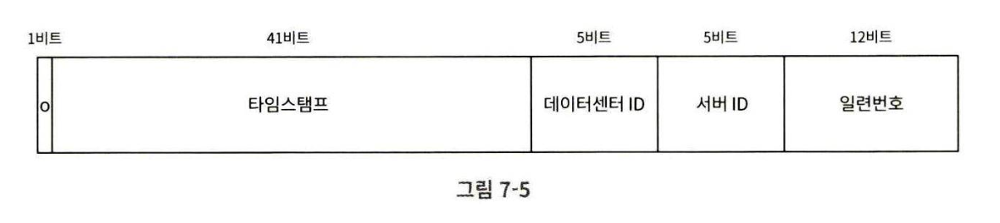

# 07장 분산 시스템을 위한 유일 ID 생성기 설계

`auto_increment` 속성이 설정된 관계형 데이터베이스의 기본 키를 쓰면 되지 않을까? 하는 생각이 있을 수 있지만, 분산 환경에서 이 방법은 통하지 않는다.  
데이터베이스 서버 한 대로는 요청 수를 감당할 수 없고, 여러 데이터베이스 서버를 쓰는 경우에는 auto_increment 값을 일관되게 유지하기 위한 동기화 비용으로 인해 지연시간이 발생하기 때문이다.

## 1단계 문제 이해 및 설계 범위 확정

Q(지원자). ID는 어떤 특성을 갖나요?  
A(면접관). ID는 유일해야 하고, 정렬 가능해야 합니다.

Q. 새로운 레코드에 붙일 ID는 항상 1만큼 큰 값이어야 하나요?  
A. ID의 값은 시간이 흐름에 따라 커질 테지만 언제나 1씩 증가한다고 할 수는 없습니다.  
다만 아침에 만든 ID 보다는 저녁에 만든 ID가 큰 값을 가져야 합니다.

Q. ID는 숫자로만 구성되나요?  
A. 그렇습니다.

Q. 시스템 규모는 어느 정도입니까?
A. 초당 10000 ID를 생성할 수 있어야 합니다.

이번 문제에 대한 답안이 만족해야 할 요구사항은 다음과 같다.
- ID는 유일
- ID는 숫자로만 구성됨
- ID는 64비트로 표현될 수 있는 값이어야 한다.
- ID는 발급 날짜에 따라 정렬 가능해야 한다.
- 초당 10000개의 ID를 만들 수 있어야 한다.

## 2단계 개략적 설계안 제시 및 동의 구하기

분산 시스템에서 유일성이 보장되는 ID를 만드는 방법은 여러 가지다.
- 다중 마스터 복제(Multi-Master Replication)
- UUID(Universally Unique Identifier)
- 티켓 서버(Ticket Server)
- 트위터 스노플레이크(Twitter Snowflake) 접근법

### 다중 마스터 복제(Multi-Master Replication)

데이터베이스의 auto_increment 기능을 활용한다.  
다만 다음 ID 값을 구할 때 현재 사용 중인 데이터베이스 서버의 수인 k를 증기사킨다.

규모 확장성 문제를 어느 정도 해결할 수 있지만
1. 여러 데이터 센터에 걸쳐 규모를 늘리기 어렵다.  
    -> 서버별 시작값, 증가폭을 모든 센터에 동기화해야 하므로 설정, 운영이 복잡
    
2. ID의 유일성은 보장되지만, 그 값이 시간 흐름에 맞춰 커지도록 보장할 수 없다.  
    -> 서버별로 독립된 수열을 쓰기 때문에 ID 크기와 실제 생성 시각이 불일치

3. 서버를 추가하거나 삭제할 때도 잘 동작하도록 만들기 어렵다.  
    -> 증가폭(k)과 시작값을 전 서버에서 변경해야 하고, 변경 과정에서 충돌・빈 슬롯 발생

### UUID

컴퓨터 시스템에 저장되는 정보를 유일하게 식별하기 위한 128비트짜리 수다.  
UUID 값은 충돌 가능성이 지극히 낮다.

#### 장점
- UUID를 만드는 것은 단순하다. 서버 사이의 조율이 필요 없으므로 동기화 이슈도 없다.
- 각 서버가 자기가 쓸 ID를 알아서 만드는 구조이므로 규모 확장도 쉽다.

#### 단점
- ID가 128 비트로 길다.
- ID를 시간 순으로 정렬할 수 없다.
- ID에 숫자 아닌 값이 포함될 수 있다.

### 티켓 서버

auto_increment 기능을 갖춘 데이터베이스 서버(티켓 서버)를 중앙 집중형으로 하나만 사용

#### 장점
- 유일성이 보장되는 오직 숫자로만 구성된 ID를 쉽게 만들 수 있다.
- 구현하기 쉽고, 중소 규모 애플리케이션에 적합하다.

#### 단점
- 티켓 서버가 SPOF가 된다.

### 트위터 스노플레이크 접근법

- 사인(sign) 비트: 1비트 할당
- 타임 스탬프(timestamp): 41비트 할당, epoch 이후 몇 밀리초가 경과했는지
- 데이터센터 ID: 5비트를 할당하여 32개 데이터센터를 지원
- 서버 ID: 5비트를 할당하여 데이터센터당 32개 서버 사용 가능
- 일련번호: 12비트 할당, 각 서버에서는 ID를 생성할 때마다 1씩 증가시킨다. 1밀리초가 경과할 때마다 0으로 초기화

## 3단계 상세 설계
데이터센터 ID와 서버 ID는 시스템이 시작할 때 결정  
타임스탬프, 일련번호는 ID 생성기가 돌고 있는 중에 만들어짐

### 타임스탬프
$2^{41}$ - 1 밀리초는 약 69년  
69년이 지나면 epoch를 바꾸거나 ID 체계를 다른 것으로 교체해야 함

### 일련번호
어떤 서버가 같은 밀리초 동안 하나 이상의 ID를 만들어 낸 경우에만 0보다 큰 값을 갖게 됨

## 4단계 마무리

스노플레이크는 모든 요구사항을 만족하면서도 분산 환경에서 규모 확장이 가능했다.

설계 이후 시간이 남았다면
- 시계 동기화(NTP; Network Time Protocol)
- 각 section 길이 최적화
- ID 생성기의 고가용성

에 대해 이야기해 볼 수 있을 것