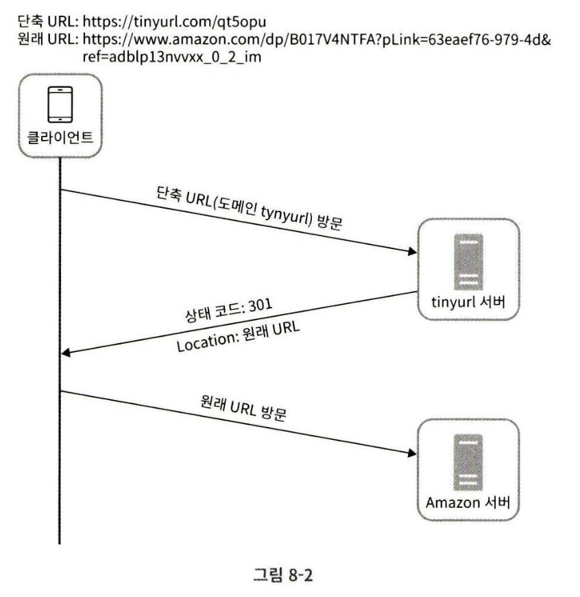
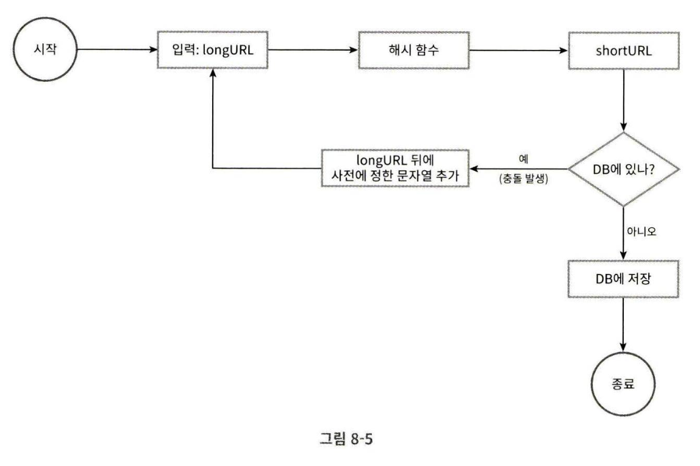

# 08장 URL 단축기 설계

## 1단계 문제 이해 및 설계 범위 확정

Q(지원자). URL 단축기 예제를 보여주세요  
A(면접관). https://github.com/column-wise/CS-DeepDive/tree/main/SystemDesign/RateLimiter 같은 입력을 받으면 https://tinyurl.com/y7ke-ocwj 같은 단축 URL을 제공해야 함

Q. 트래픽 규모는?  
A. 매일 1억 개의 단축 URL을 만들 수 있어야 함.

Q. URL 길이는?  
A. 짧을수록 좋다.

Q. 단축 URL에 포함될 문자는?  
A. 숫자, 영문자(a-z, A-Z)

Q. 단축된 URL을 시스템에서 지우거나 갱신할 수 있어야 하나?
A. 시스템을 단순화하기 위해 삭제나 갱신은 생각하지 않는다.

### 요구사항
1. URL 단축: 주어진 긴 URL을 훨씬 짧게 줄인다.
2. URL 리디렉션(Redirection): 축약된 URL로 HTTP 요청이 오면 원래 URL로 안내
3. 높은 가용성과 규모 확장성, 장애 감내가 요구됨

### 개략적 추정
- 쓰기 연산: 매일 1억 개의 단축 URL 생성
- 초당 쓰기 연산: 1억/24/3600 = 1160
- 읽기 연산: 읽기 연산과 쓰기 연산 비율을 10:1이라 하면 읽기 연산은 초당 11600회 발생
- URL 단축 서비스를 10년간 운영한다고 하면 3650억 레코드를 보관해야 함.  
    -> 축약 전 URL의 평균 길이를 100이라고 하면, 36.5 TB의 저장 용량이 필요함.

## 2단계 개략적 설계안 제시 및 동의 구하기

### API 엔드포인트

1. URL 단축용 엔드포인트

    `POST /api/v1/data/shorten`
    * 인자: {longUrl: longURLstring}
    * 반환: 단축 URL

2. 리디렉션용 엔드포인트

    `GET /api/v1/shortUrl`
    * 반환: HTTP 리디렉션 목적지가 될 원래 URL

### URL 리디렉션

단축 URL을 받은 서버는 그 URL을 원래 URL로 바꾸어서 301 응답의 `Location` 헤더에 넣어 반환한다.



* 301 Permanently Moved:   
해당 URL에 대한 HTTP 요청의 처리 책임이 영구적으로 Location 헤더에 반환된 URL로 이전되었다는 응답이다.  
영구적으로 이전되었으므로, 브라우저는 이 응답을 캐시한다.

* 302 Found:  
    주어진 URL로의 요청이 일시적으로 Location 헤더에 담긴 URL에 의해 처리되어야 한다는 응답이다.  
    따라서 클라이언트의 요청은 언제나 단축 URL 서버에 먼저 보내진 후에 원래 URL로 리디렉션 되어야 한다.

서버 부하를 줄이는 것이 목적이라면 301, 트래픽 분석이 중요할 때는 302를 사용하는 것이 클릭 발생률이나 발생 위치를 추적하는 데 좀 더 유리할 것이다.

### URL 단축
긴 URL을 해시 값으로 대응시킬 함수 $f(x)$를 찾아야 하는데,
- 입력으로 주어지는 긴 URL이 다른 값이면 해시 값도 달라야 하낟.
- 계산된 해시 값은 원래 입력으로 주어졌던 긴 URL로 복원될 수 있어야 한다.

## 3단계 상세 설계

### 데이터 모델

<단축 URL, 원래 URL> 순서쌍을 관계형 데이터베이스에 저장
```
+-----------------+
|       URL       |
+-----+-----------+
| PK  | id        | 
+-----+-----------+
|     | shortURL  | 
|     | longURL   | 
+-----+-----------+
```

### 해시 함수

#### 해시 값 길이
hashValue는 [0-9, a-z, A-Z]의 문자들로 구성됨(62개)

$62^n >= 3650억$ 을 만족하는 n의 최솟값을 찾아야 하는데, n이 7이면 3.5조개의 URL을 만들 수 있다.

#### 해시 후 충돌 해소

잘 알려진 해시 함수, CRC32, MD5, SHA-1을 사용해도 7보다 길다.

1. 계산된 해시 값에서 처음 7개 글자만 이용한다.  
    -> 충돌 확률이 높아짐  
    -> 그럼 어떡함?  
    -> 충돌이 발생하면 충돌이 해소될 때까지 사전에 정한 문자열을 해시값에 붙임

    

    충돌은 해소할 수 있지만 단축 URL을 생성할 때마다 DB에 해당 단축 URL이 있는지 조회해야 하므로 오버헤드가 크다.  
    블룸 필터를 사용하면 성능을 높일 수 있다.

2. base-62 변환

10진수를 62진수로 변환

ex) $11157_{10}$을 62진수로 변환  
    -> $11157_{10}$ = $ 2 * 62^2 + 55 * 62^1 + 59 * 62^0$ = $2TX_{62}$

### URL 단축기 상세 설계

1. 입력으로 긴 URL을 받는다.
2. DB에 해당 URL이 있는지 검사

    2-1. DB에 있다면 해당 URL에 대한 단축 URL을 만든 적이 있으므로  
    해당 단축 URL을 클라이언트에 반환

    2-2. DB에 없다면 해당 URL은 새로 접수된 것이므로 유일한 ID를 생성한다. 이 ID는 DB의 기본 키로 사용된다.

3. 62진법 변환하여 ID를 새 단축 URL로 만든다.

4. ID, 단축 URL, 원래 URL로 새 데이터베이스 레코드를 만든 후 단축 URL을 클라이언트에 전달한다.

## 4단계 마무리

설계를 마친 후 시간이 남는다면
- 처리율 제한 장치
- 웹 서버의 규모 확장
- 데이터베이스의 규모 확장
- 데이터 분석 솔루션(Analytics)