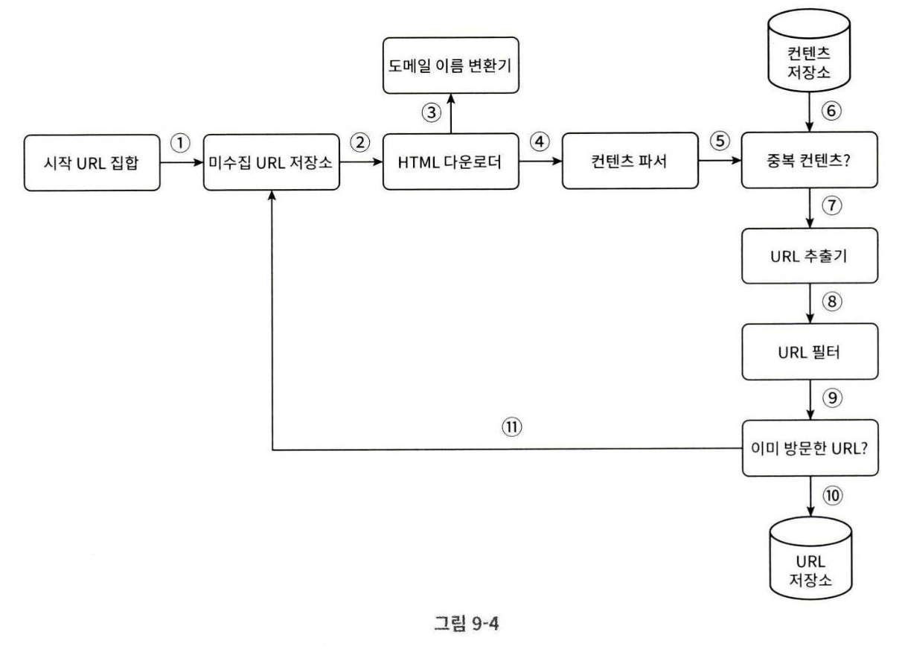

# 09 웹 크롤러 설계

- 검색 엔진 인덱싱(Search Engine Indexing)

    크롤러는 웹 페이지를 모아 검색 엔진을 위한 로컬 인덱스(local index)를 만든다.

- 웹 아카이빙(Web Archiving)

    나중에 사용할 목적으로 장기보관하기 위해 웹에서 정보를 모으는 절차를 말한다.

- 웹 마이닝(Web Mining)

    유용한 지식을 수집(주주 총회 자료나 연차 보고서 등)

- 웹 모니터링(Web monitoring)

    인터넷에서 저작권이나 상표권이 침해되는 사례 모니터링

## 1단계 문제 이해 및 설계 범위 확정

1. URL 집합이 입력으로 주어지면, 해당 URL들이 가리키는 모든 웹 페이지를 다운로드 한다.

2. 다운받은 웹 페이지에서 URL들을 추출한다.

3. 추출된 URL들을 다운로드할 URL 목록에 추가하고, 위 과정을 반복한다.

Q(지원자). 이 크롤러의 목적은 무엇인가요?  
A(면접관). 검색 엔진 인덱싱에 사용할 것입니다.

Q. 매달 얼마나 많은 웹 페이지를 수집해야 하나요?  
A. 10억 개의 웹 페이지를 수집해야 합니다.

Q. 새로 만들어진 웹 페이지나 수정된 웹 페이지도 고려해야 하나요?  
A. 네

Q. 수집한 웹 페이지는 저장해야 하나요?  
A. 5년동안 저장해야 합니다.

Q. 중복된 콘텐츠는 어떻게 하나요?  
A. 중복된 콘텐츠는 무시해도 됩니다.

면접관과 크롤러 기능 요구사항을 명확히 하는 한편, 좋은 웹 크롤러가 만족시켜야 할 다음과 같은 속성에 주의를 기울이는 것도 바람직하다.

- 규모 확장성
- 안정성(Robustness)  
    잘못 작성된 HTML, 아무 반응 없는 서버, 장애, 악성 코드가 붙어 있는 링크 등에 대응할 수 있어야 함
- 예절(Politeness)  
    수집 대상 웹 사이트에 짧은 시간 동안 너무 많은 요청을 보내서는 안된다.
- 확장성(Extensibility)  
    새로운 형태의 콘텐츠를 지원하기 쉬워야 한다.  
    이미지 파일 등

### 개략적 규모 추정
- 매달 10억 개의 웹 페이지를 다운로드 한다.
- QPS = 10억/30일/24시간/3600초 = 대략 400페이지/초
- Peak QPS = 2 * QPS = 800
- 웹 페이지의 크기 평균은 500k 라고 가정
- 10억 페이지 * 500k = 500 TB/월
- 5년간 보관한다면 30PB의 저장용량이 필요하다.

## 2단계 개략적 설계안 제시 및 동의 구하기

### 시작 URL 집합

전체 웹을 크롤링해야 하는 경우에는 시작 URL을 고를 때 좀 더 창의적일 필요가 있다.

가능한 한 많은 링크를 탐색할 수 있도록 하는 URL을 고르는 것이 바람직할 것이다.

나라별로/주제별로 나눌 수 있다.

### 미수집 URL 저장소

다운로드할 URL을 저장 관리하는 컴포넌트를 미수집 URL 저장소(URL Frontier)라고 부른다.

### HTML 다운로더

### 콘텐츠 파서
웹 페이지를 다운로드 하면 파싱과 검증 절차를 거쳐야 한다.

### 중복 콘텐츠인가?

웹 페이지의 해시 값을 비교하여 효율적으로 중복 콘텐츠인지를 확인할 수 있다.

### 콘텐츠 저장소
저장할 데이터의 유형, 크기, 저장소 접근 빈도, 데이터의 유효 기간 등을 종합적으로 고려해야 한다.
- 데이터 양이 너무 많으므로 대부분의 콘텐츠는 디스크에 저장한다.
- 인기 있는 콘텐츠는 메모리에 두어 접근 지연시간을 줄인다.

### URL 추출기
상대 경로를 절대 경로로 변환한다.

### URL 필터
특정 콘텐츠 타입이나 파일 확장자를 갖는 URL, 접속시 오류가 발생하는 URL, 접근 제외 목록(Deny List)에 포함된 URL 등을 크롤링 대상에서 배제

### 이미 방문한 URL?
이미 방문한 URL이나 미수집 URL 저장소에 보관된 URL을 추적할 수 있도록 블룸 필터나 해시 테이블을 사용한다.

### URL 저장소
이미 방문한 URL을 보관하는 저장소다.

### 웹 크롤러 작업 흐름

1. 시작 URL들을 미수집 URL 저장소에 저장
2. HTML 다운로더는 미수집 URL 저장소에서 URL 목록을 가져온다.
3. HTML 다운로더는 도메인 이름 변환기를 사용하여 URL의 IP 주소를 알아내고, 해당 IP 주소로 접속하여 웹 페이지를 다운받는다.
4. 콘텐츠 파서는 다운된 HTML 페이지를 파싱하여 올바른 형식을 갖춘 페이지인지 검증한다.
5. 콘텐츠 파싱과 검증이 끝나면 중복 콘텐츠인지 확인하는 절차를 거친다.
6. 중복  콘텐츠인지 확인하기 위해 해당 페이지가 이미 저장소에 있는지 본다.
    - 저장소에 있으면 처리하지 않고 버린다.
    - 저장소에 없으면 저장소에 저장하고, URL 추출기로 전달한다.
7. URL 추출기는 해당 HTML 페이지에서 링크를 골라낸다.
8. 골라낸 링크를 URL 필터로 전달한다.
9. 필터링이 끝나고 남은 URL만 중복 URL 판별 단계로 전달한다.
10. 이미 처리한 URL인지 확인하기 위해, URL 저장소에 보관된 URL인지 살핀다. 이미 저장된 URL은 버린다.
11. 저장소에 없는 URL은 URL 저장소, 미수집 URL 저장소에도 전달한다.

## 3단계 상세 설계

- DFS vs BFS
- 미수집 URL 저장소
- HTML 다운로더
- 안정성 확보 전략
- 확장성 확보 전략
- 문제 있는 콘텐츠 감시 및 회피 전략

### DFS를 쓸 것인가 BFS를 쓸 것인가
웹은 유향 그래프와 같다.

DFS는 좋은 선택이 아닐 수 있는데, 그래프 크기가 클 경우 깊이를 가늠하기 어렵기 때문이다.  
그래서 웹 크롤러는 보통 BFS를 사용한다.

하지만 단순 BFS에는 문제가 있다.
1. 한 페이지에서 나오는 링크의 상당수는 같은 서버로 되돌아간다.  
    결국 크롤러는 같은 호스트에 속한 많은 링크를 다운받느라 바빠지게 된다.  
    이 링크들을 병렬로 처리하게 된다면 동일한 호스트에 수 많은 요청을 보내게 되어 예의 없는(Impolite) 크롤러로 간주된다.

2. 모든 웹 페이지가 같은 수준의 품질, 같은 수준의 중요성을 갖지 않기 때문에 페이지 별로 순위, 사용자 트래픽, 업데이트 빈도를 고려하여 우선순위를 주어야 한다.

### 미수집 URL 저장소

#### 예의
수집 대상 서버로 짧은 시간 안에 너무 많은 요청을 보내는 것은 무례한 일이며, DoS 공격으로 간주되기도 한다.

같은 웹 사이트의 페이지를 다운받는 태스크는 시간차를 두고 실행하도록 하면 된다.

다운로드 스레드 별로 FIFO 큐를 두어 같은 호스트에 속한 URL을 같은 큐로 가도록 보장할 수 있도록 구현할 수 있다.
- 큐 라우터
- 매핑 테이블: 호스트 이름과 큐 사이의 관계를 보관
- FIFO 큐
- 큐 선택기: 큐들을 순회하며 큐에서 URL을 꺼내 해당 큐에서 나온 URL을 다운로드 하도록 지정된 작업 스레드에 전달
- 작업 스레드: 전달된 URL을 다운로드하는 작업 수행

#### 우선순위
유용성에 따라 URL의 우선순위를 나눌 때는 페이지 랭크(PageRank), 트래픽 양, 갱신 빈도 등 다양한 척도를 사용할 수 있다.

#### 신선도
웹 페이지는 수시로 추가, 삭제, 변경된다.  
따라서 데이터의 신선함을 유지하기 위해 이미 다운로드한 페이지도 주기적으로 재수집할 필요가 있다.

- 웹 페이지의 변경 이력 활용
- 우선순위를 활용하여, 중요한 페이지는 좀 더 자주 재수집

#### 미수집 URL 저장소를 위한 지속성 저장장치
대부분의 URL을 디스크에 두지만 IO 비용을 줄이기 위해 메모리 버퍼에 큐를 두고, 버퍼에 있는 데이터를 주기적으로 디스크에 기록

### HTML 다운로더

HTML 다운로더는 HTTP 프로토콜을 사용해 웹 페이지를 내려받는다.

#### Robots.txt
로봇 제외 프로토콜이라고도 부르는 웹 사이트와 크롤러가 소통하는 표준 방법이다.

이 파일에는 크롤러가 수집해도 되는 페이지 목록이 들어있다.

#### 성능 최적화

1. 분산 크롤링  
    성능을 높이기 위해 작업을 여러 서버에 분산  
    각 서버는 여러 스레드를 이용하여 다운로드 작업을 처리

2. 도메인 이름 변환 결과 캐시  
    DNS Resolver는 크롤러 성능의 병목 중 하나인데,  
    이는 DNS 요청을 보내고 결과를 받는 작업의 동기적 특성 때문이다.

    크롤러 스레드 가운데 어느 하나라도 이 작업을 하고 있으면 다른 스레드의 DNS 요청은 모두 블록된다.

    DNS 조회 결과로 얻어진 도메인 이름과 IP 주소 사이의 관계를 캐시에 보관해놓고 크론 잡 등으로 주기적으로 갱신하도록 해 놓으면 성능을 높일 수 있다.

3. 지역성  
    크롤링 작업을 수행하는 서버를 지역적으로 분산,  
    크롤링 대상 서버와 지역적으로 가깝게 두어 페이지 다운로드 시간을 줄이는 것

4. 짧은 타임아웃  
    응답하지 않는 웹 서버를 처리하기 위함

#### 안정성
- 안정 해시(Consistent Hashing)

    다운로더 서버들에 부하를 분산할 때 적용  
    다운로더 서버를 쉽게 추가하고 삭제할 수 있다.

- 크롤링 상태 및 수집 데이터 저장

    장애가 발생해도 복구할 수 있도록 지속적 저장장치에 기록

- 예외 처리

    예외가 발생해도 전체 시스템이 중단되지 않도록

- 데이터 검증

#### 확장성

- PNG 다운로더는 플러그인 모듈이다.
- 웹 모니터는 웹을 모니터링하여 저작권이나 상표권이 침해되는 일을 막는 모듈이다.

#### 문제 있는 콘텐츠 감지 및 회피

1. 중복 콘텐츠

    해시나 체크섬을 사용하면 중복 콘텐츠를 쉽게 탐지할 수 있다.

2. 거미 덫

    크롤러를 무한 루프에 빠뜨리도록 설계한 웹 페이지

    덫을 자동으로 피해가는 알고리즘을 만들어내는 것은 까다롭다.  
    사람이 수작업으로 덫을 확인하고 크롤러 탐색 대상에서 제외하거나 URL 필터 목록에 걸어둘 수 있다.

3. 데이터 노이즈

    광고, 스크리트 코드, 스팸 URL 등  
    가능하면 제외해야 한다.

## 4단계 마무리

시간이 허락한다면
- 서버 측 렌더링(Server-Side Rendering)
- 원치 않는 페이지 필터링
- 데이터베이스 다중화 및 샤딩
- 수평적 규모 확장성
- 가용성, 일관성, 안정성
- 데이터 분석 솔루션

등에 대해 면접관과 추가적인 대화를 나눌 수도 있겠다.