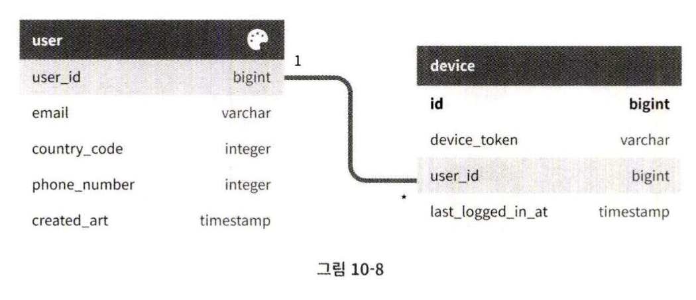
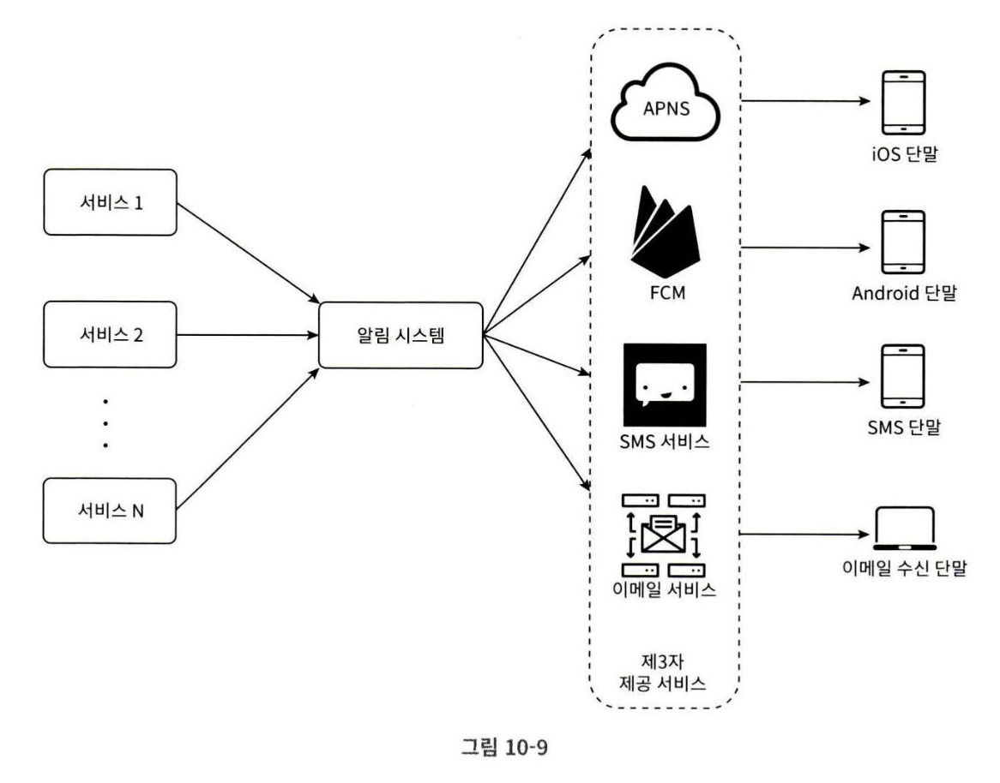
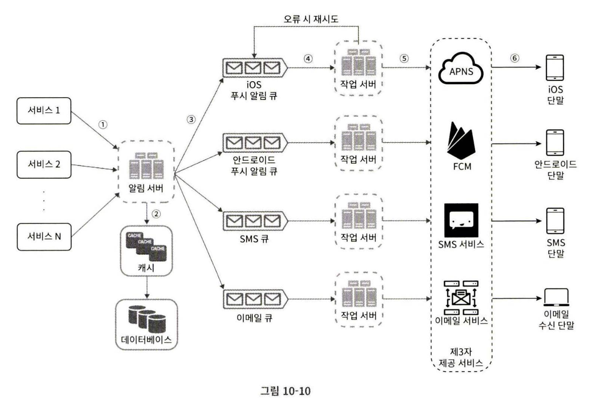
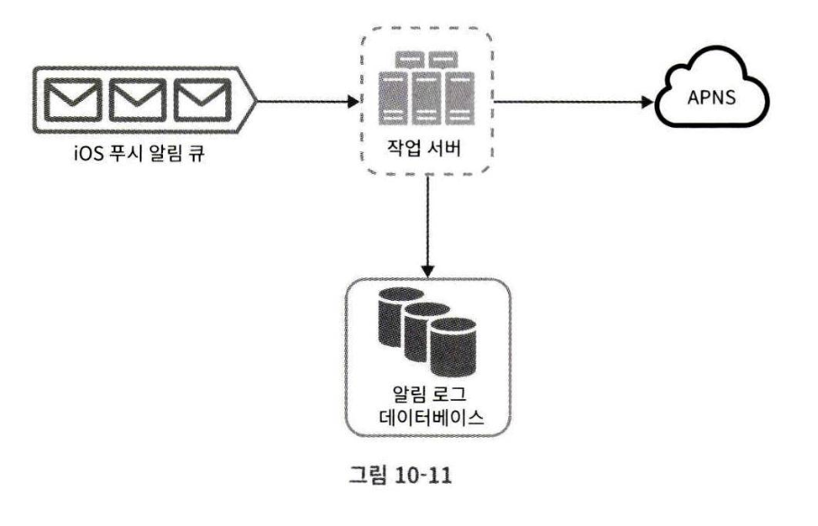
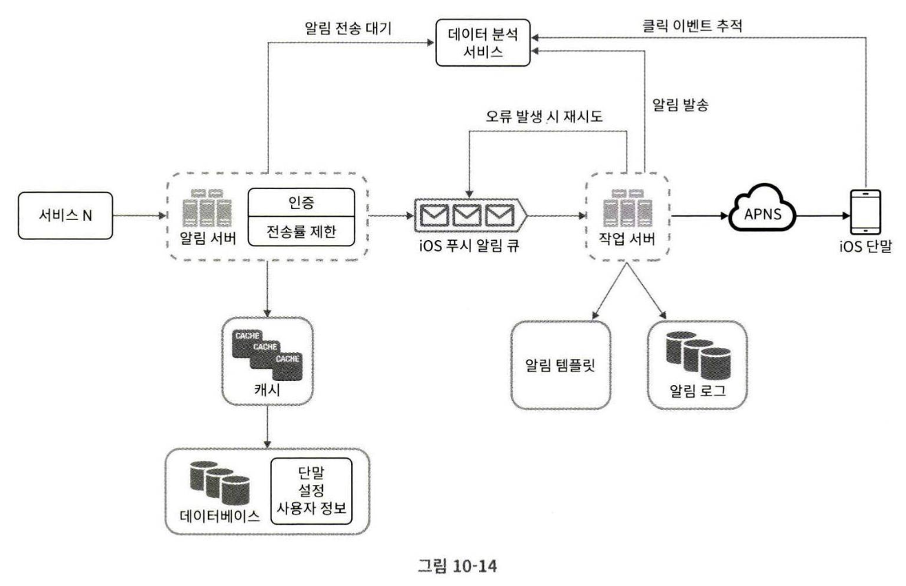

# 10장 알림 시스템 설계

알림 시스템이 있는 애플리케이션 프로그램은 최신 뉴스, 제품 업데이트, 이벤트, 선물 등 고객에게 중요할 만한 정보를 비동기적으로 제공한다.

알림 시스템은 모바일 푸시 알림, SMS 메시지, 이메일 세 가지로 분류할 수 있다.

## 1단계 문제 이해 및 설계 범위 확정

하루에 백만 건 이상의 알림을 처리하는 확장성 높은 시스템을 구축하는 것이 쉬운 과제는 아니다.

Q. 어떤 종류의 알림을 지원해야 하나?  
A. 푸시 알림, SMS 메시지, 이메일

Q. 실시간(real-time)이어야 하나?  
A. 연성 실시간(soft real-time) 시스템으로 가정,  
가능한 한 빨리 전달되어야 하지만, 시스템에 높은 부하가 걸렸을 때 약간의 지연은 괜찮음

Q. 어떤 종류의 단말 지원?  
A. iOS, 안드로이드, 랩탑/데스크탑

Q. 알림은 누가 만드나?  
A. 클라이언트 애플리케이션 프로그램이 만들수도 있고, 서버측에서 스케줄링 할 수도 있다.

Q. 사용자가 알림을 받지 않도록 설정할 수도 있어야 하나?  
A. 그렇다.

Q. 하루에 몇 건의 알림을 보낼 수 있어야 하나?  
A. 천만 건의 모바일 푸시 알림, 백만 건의 SMS, 5백만 건의 이메일

## 2단계 개략적 설계안 제시 및 동의 구하기

- 알림 유형별 지원 방안
- 연락처 정보 수집 절차
- 알림 전송 및 수신 절차

### 알림 유형별 지원 방안

#### iOS 푸시 알림
- 알림 제공자(provider): 알림 요청(notification request)을 만들어 애플 푸시 알림 서비스(APNS: Apple Push Notification Service)로 보내는 주체  

    알림 요청을 만들려면 다음과 같은 데이터가 필요하다.
    - 단말 토큰(device token): 알림 요청을 보내는 데 필요한 고유 식별자다.
    - 페이로드(payload): 알림 내용을 담은 JSON 딕셔너리(dictionary)다.
    
        ```json
        {
            "aps": {
                "alert": {
                    "title": "Game Request",
                    "body": "Bob wants to play chess",
                    "action-loc-key": "PLAY"
                },
                "badge": 5
            }
        }
        ```

- APNS: 애플이 제공하는 원격 서비스, 푸시 알림을 iOS 장치로 보내는 역할

- iOS 단말: 푸시 알림 수신

#### 안드로이드 푸시 알림

APNS 대신 FCM(Firebase Cloud Messaging) 사용

#### SMS 메시지

SMS 메시지를 보낼 때는 트윌리오(Twilio), 넥스모(Nexmo) 같은 서드파티 서비스를 많이 이용한다.

#### 이메일

많은 회사가 상용 이메일 서비스를 이용한다.  
센드그리드(Sendgrid), 메일침프(Mailchimp)등이 있다.  
데이터 분석 서비스도 제공

### 연락처 정보 수집 절차

알림을 보내려면 모바일 단말 토큰, 전화번호, 이메일 주소 등의 정보가 필요하다.

사용자가 계정을 등록하면 API 서버는 사용자의 정보를 수집하여 데이터베이스에 저장해야 한다.

테이블 구조 예시


### 알림 전송 및 수신 절차

#### 개략적 설계안(초안)
- 1~N개의 서비스: 크론잡, 분산 시스템 컴포넌트, 과금 서비스, 쇼핑몰 웹사이트 등
- 알림 시스템(notification system): 서비스 1~N에 알림 전송을 위한 API를 제공해야 하고, 제3자 서비스에 전달할 알림 페이로드를 만들어낼 수 있어야 한다.
- 제3자 서비스(third party services): 사용자에게 알림을 실제로 전달하는 역할



이 설계에는 몇 가지 문제가 있다.

1. SPOF: 알림 서비스에 서버가 하나라 그 서버에 장애가 생기면 전체 서비스의 장애로 이어진다.

2. 규모 확장성: 한 대 서비스로 푸시 알림에 관계된 모든 것을 처리하므로, 데이터베이스나 캐시 등 중요 컴포넌트의 규모를 개별적으로 늘릴 방법이 없다.

3. 성능 병목

#### 개략적 설계안(개선)

- 데이터베이스와 캐시를 알림 시스템의 주 서버에서 분리한다.
- 알림 서버를 증설하고 자동으로 수평적 규모 확장이 이루어질 수 있도록 한다.
- 메시지 큐를 이용해 시스템 컴포넌트 사이의 강한 결합을 끊는다.



- 알림 서버
    - 알림 전송 API: 스팸 방지를 위해 사내 서비스 또는 인증된 클라이언트만 이용 가능
    - 알림 검증(validation): 이메일 주소, 전화번호 등에 대한 기본적 검증을 수행
    - 데이터베이스 또는 캐시 질의: 알림에 포함시킬 데이터를 가져오는 기능
    - 알림 전송: 알림 데이터를 메시지 큐에 넣는다.

- 캐시: 사용자 정보, 단말 정보, 알림 템플릿 등을 캐시
- 데이터베이스: 사용자, 알림, 설정 등 다양한 정보 저장
- 메시지 큐: 시스템 컴포넌트 간 의존성을 제거하기 위해 사용. 다량의 알림을 담을 버퍼 역할도 수행함
- 작업 서버(worker): 메시지 큐에서 알림을 꺼내서 제3자 서비스로 전달

## 3단계 상세 설계

- 안정성
- 추가로 필요한 컴포넌트 및 고려사항: 알림 템플릿, 알림 설정, 전송률 제한, 재시도 메커니즘(retry mechanism), 보안, 큐에 보관된 알림에 대한 모니터링과 이벤트 추적
- 개선된 설계안

### 안정성

#### 데이터 손실 방지
알림이 지연되거나 순서가 틀려도 괜찮지만, 사라지면 안됨.

알림 데이터를 데이터베이스에 보관하고 재시도 메커니즘을 구현해야 함


#### 알림 중복 전송 방지

보내얄 할 알림이 도착하면 그 이벤트 ID를 검사하여 중복된 이벤트면 버리는 로직이 필요할 수 있다.

### 추가로 필요한 컴포넌트 및 고려사항

#### 알림 템플릿
알림 메시지 대부분은 형식이 비슷하다.  
템플릿을 사용하면 전송될 알림들의 형식을 일관성 있게 유지할 수 있고, 알림 작성에 드는 시간도 줄일 수 있다.

#### 알림 설정

사용자가 알림 설정을 조절할 수 있도록 알림 설정 테이블을 두고, 다음과 같은 필드를 포함할 수 있을 것

| 컬럼명    | 타입     | 설명                                   |
|-----------|----------|----------------------------------------|
| user_id   | bigint   | 사용자 ID                              |
| channel   | varchar  | 알림이 전송될 채널 (푸시, 이메일, SMS 등) |
| opt_in    | boolean  | 해당 채널로 알림을 받을 것인지 여부       |

#### 전송률 제한

한 사용자가 받을 수 있는 알림의 빈도를 제한하는 기능  
알림을 너무 많이 보내면 사용자가 알림 기능을 아예 꺼 버릴 수 있으므로

#### 재시도 방법

제3자 서비스가 알림 전송에 실패하면, 해당 알림을 재시도 전용 큐에 넣는다.  
같은 문제가 지속적으로 발생하면 개발자에게 alert

#### 푸시 알림과 보안

iOS와 안드로이드 앱의 경우, 알림 전송 API는 appKey와 appSecret을 사용하여 보안을 유지한다.  
인증된 혹은 승인된 클라이언트만 해당 API를 사용하여 알림을 보낼 수 있다.

#### 큐 모니터링

큐에 쌓인 알림의 개수 등을 추적하여 작업 서버의 수를 증설/삭제할 수 있도록 하는 것이 바람직

#### 이벤트 추적

알림 확인, 클릭율, 실제 앱 사용으로 이어지는 비율 등의 메트릭을 추적할 수 있어야 한다.

### 수정된 설계안



- 알림 서버에 인증, 전송률 제한 기능 추가
- 전송 실패 시 재시도 기능 추가
- 전송 템플릿 추가
- 모니터링, 추적 시스템 추가

## 4단계 마무리

시스템 컴포넌트 사이의 결합도를 낮추기 위한 메시지 큐 사용

- 안정성: 재시도 메커니즘
- 보안: appKey, appSecret 등
- 이벤트 추적 및 모니터링: 알림 전송의 각 단계마다 이벤트 추적, 모니터링 시스템 추가
- 사용자 설정: 사용자가 알림 수신 설정을 조절할 수 있도록 함
- 전송률 제한: 사용자에게 알림을 보내는 빈도를 제한할 수 있도록 함