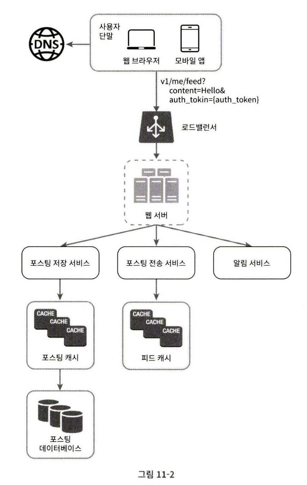
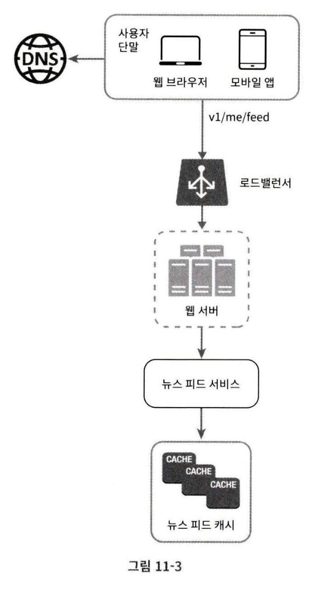
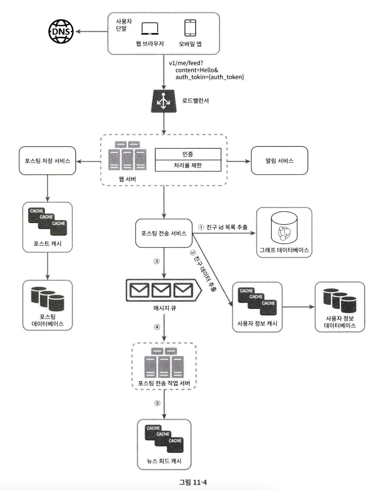
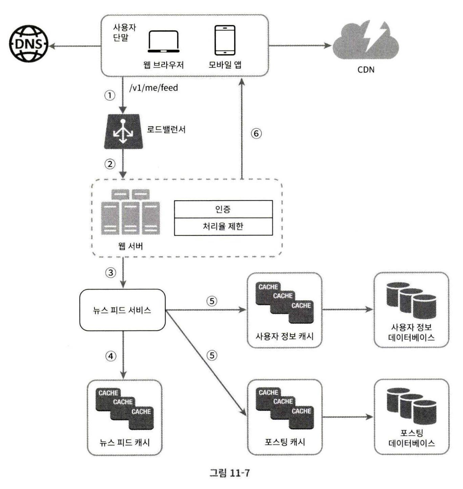

# 11장 뉴스 피드 시스템 설계

>여러분의 홈 페이지 중앙에 지속적으로 업데이트되는 스토리들로, 사용자 상태 정보 업데이트, 사진, 비디오, 링크, 앱 활동, 여러분이 페이스북에서 팔로하는 사람들, 페이지, 또는 그룹으로부터 나오는 좋아요 등을 포함한다.  
facebook

## 1단계 문제 이해 및 설계 범위 확정

Q. 모바일 앱? 웹?  
A. 둘 다.

Q. 중요 기능?  
A. 사용자는 피드에 새 스토리 업로드가 가능해야 하고, 친구들이 올리는 스토리를 볼 수 있어야 함.

Q. 스토리 표시 순서는?  
A. 시간 흐름 역순으로 표시한다고 가정

Q. 한 명의 사용자는 최대 몇 명의 친구를 가질 수 있나?  
A. 5000명.

Q. 트래픽 규모는?  
A. 매일 천만 명이 방문한다고 가정(DAU 10million)

Q. 피드에 이미지나 비디오 스토리도 올릴 수 있나?  
A. ㅇㅇ

## 2단계 개략적 설계안 제시 및 동의 구하기

1. 피드 발행: 사용자가 스토리를 포스팅하면 해당 데이터를 캐시와 데이터베이스에 기록.

2. 뉴스 피드 생성: 뉴스 피드는 모든 친구의 포스팅을 시간 흐름 역순으로 모아서 생성한다고 가정

### 뉴스 피드 API

#### 피드 발행 API

새 스토리를 포스팅하기 위한 API.

`POST /v1/me/feed`  
- Authorization 헤더
- 포스팅 내용을 담은 바디

#### 피드 읽기 API

`GET /v1/me/feed`
- Authorization 헤더

### 피드 발행

- 사용자: `POST /v1/me/feed`를 사용하여 새 포스팅을 올림
- 로드밸런서: 트래픽을 웹 서버들로 분산
- 웹 서버: HTTP 요청을 내부 서비스로 중계
- 포스팅 저장 서비스: 새 포스팅을 DB와 캐시에 저장
- 포스팅 전송 서비스: 새 포스팅을 친구의 뉴스 피드에 푸시.  
뉴스 피드 데이터는 캐시에 보관하여 빠르게 읽을 수 있도록 함
- 알림 서비스: 친구들에게 새 포스팅이 올라왔음을 알리거나 푸시 알림을 보낸다.

### 뉴스 피드 생성

- 사용자: `GET /v1/me/feed` API 사용
- 뉴스 피드 서비스: 캐시에서 뉴스 피드를 가져온다.
- 뉴스 피드 캐시: 뉴스 피드를 렌더링할 때 필요한 피드 ID를 보관

## 3단계 상세 설계

### 피드 발행 흐름 상세 설계

#### 웹 서버

올바른 인증 토큰을 Authorization 헤더에 넣고 API를 호출하는 사용자만 포스팅을 할 수 있어야 한다.

스팸을 막고 유해한 콘텐츠가 자주 올라오는 것을 막기 위해 처리율 제한 로직도 포함해야 한다.

#### 포스팅 전송(팬아웃) 서비스

어떤 사용자의 새 포스팅을 친구 관계에 있는 모든 사용자에게 전달하는 과정

- 쓰기 시점에 팬아웃

    새로운 포스팅을 기록하는 시점에 뉴스 피드 갱신

    장점

    - 뉴스 피드가 실시간으로 갱신되며 친구 목록에 있는 사용자에게 즉시 전송됨
    - 새 포스팅이 기록되는 순간에 뉴스 피드가 이미 갱신(pre-computed)되므로 뉴스 피드를 읽는 데 드는 시간이 짧아진다.

    단점
    - 친구가 많은 경우 친구 목록을 가져오고 친구 모두의 뉴스 피드를 갱신하는 데 많은 시간이 소요될 수 있다.(hotkey)
    - 서비스를 자주 이용하지 않는 사용자의 피드까지 갱신해야 하므로 자원이 낭비된다.

- 읽기 시점에 팬아웃

    피드를 읽어야 하는 시점에 뉴스 피드를 갱신(on-demand)

    장점
    - 비활성화된 사용자, 서비스에 거의 로그인하지 않는 사용자의 경우 유리함
    - 데이터를 친구 각각에 푸시하는 작업이 필요 없으므로 핫키 문제도 생기지 않는다.

    단점
    - 뉴스 피드를 읽는 데 많은 시간이 소요될 수 있다.

뉴스 피드를 빠르게 가져올 수 있도록 하는 것은 매우 중요하므로 대부분의 사용자에 대해서는 푸시 모델을 사용,  
친구나 팔로어가 아주 많은 경우에는 팔로어로 하여금 해당 사용자의 포스팅을 필요할 때 가져가도록 하는 풀 모델을 사용

\+ 안정 해시를 이용해 핫키 문제를 줄여보자.

1. 그래프 데이터베이스에서 친구 ID 목록을 가져온다.
2. 사용자 정보 캐시에서 친구들의 정보를 불러온다.  
사용자 설정에 따라 친구 가운데 일부를 걸러낸다.(피드 업데이트 무시 설정 등)
3. 친구 목록과 새 스토리의 포스팅 ID를 메시지 큐에 넣는다.
4. 팬아웃 작업 서버가 메시지 큐에서 데이터를 꺼내어 뉴스 피드 데이터를 뉴스 피드 캐시에 넣는다.  
뉴스 피드 캐시는 <포스팅ID, 사용자 ID> 순서쌍을 보관하는 매핑 테이블과 유사

### 피드 읽기 흐름 상세 설계

1. 사용자가 `GET /v1/me/feed` 호출
2. 로드 밸런서가 요청을 웹 서버 중 하나로 보냄
3. 웹 서버는 피드를 가져오기 위해 뉴스 피드 서비스를 호출
4. 뉴스 피드 서비스는 뉴스 피드 캐시에서 포스팅 ID 목록을 가져온다.
5. 뉴스 피드에 표시할 사용자 이름, 사용자 사진, 포스팅 콘텐츠, 이미지 등을 사용자 캐시와 포스팅 캐시에서 가져와 완전한 뉴스 피드를 만든다.
6. 생성된 뉴스 피드를 JSON 형태로 클라이언트에게 보낸다. 클라이언트는 해당 피드를 렌더링한다.

### 캐시 구조

- 뉴스 피드: 뉴스 피드의 ID를 보관한다.
- 콘텐츠: 포스팅 데이터를 보관한다. 인기 콘텐츠는 따로 보관한다.
- 소셜 그래프: 사용자 간 관계 정보를 보관
- 행동(action): 포스팅에 대한 사용자의 행위에 관한 정보를 보관, 좋아요, 답글 등등
- 횟수(counter): 좋아요 횟수, 응답 수, 팔로워 수, 팔로잉 수 등의 정보 보관

## 4단계 마무리

시간이 남는다면 규모 확장성 이슈 논의하는 것도 좋겠다.

데이터베이스 규모 확장
- 수직적 규모 확장 vs 수평적 규모 확장
- SQL vs NoSQL
- 주-부(master-slave) 다중화
- 복제본(replica)에 대한 읽기 연산
- 일관성 모델(consistency model)
- 데이터베이스 샤딩(sharding)

\+ 웹 계층을 무상태로 운영하기.  
\+ 가능한 한 많은 데이터 캐시할 방법.  
\+ 여러 데이터 센터를 지원할 방법.  
\+ 메시지 큐를 사용하여 컴포넌트 사이의 결합도 낮추기.  
\+ 핵심 메트릭에 대한 모니터링.  
    ex. QPS, 피드 새로고침 시 지연시간 등