# 12장 채팅 시스템 설계

## 1단계 문제 이해 및 설계 범위 확정
Q. 1:1 입니까 그룹 채팅 앱입니까?  
A. 둘 다

Q. 모바일 앱인가요 웹 앱인가요  
A. 둘 다

Q. 트래픽 규모는??  
A. DAU 5천만입니다.

Q. 그룹 채팅의 경우 인원 제한이 있습니까?  
A. 최대 100명

Q. 중요 기능이 뭘까요  
A. 1:1 채팅, 그룹 채팅, 사용자 접속 상태 표시, 텍스트 메시지(첨부파일 x)

Q. 메시지 길이에 제한이 있나요
A. 100,000자 이하

Q. 종단 간 암호화를 지원해야 하나요?  
A. 현재로서는 필요 없지만 시간이 허락하면 논의해보죠

Q. 채팅 이력은 얼마나 보관해야 하나요?  
A. Forever.

요구사항 정리
- 응답지연이 낮은 일대일 채팅
- 최대 100명까지 참여할 수 있는 그룹 채팅 기능
- 사용자의 접속상태 표시 기능
- 다양한 단말 지원. 하나의 계정으로 여러 단말에 동시 접속 지원
- 푸시 알림

## 2단계 개략적 설계안 제시 및 동의 구하기

클라이언트는 서로 직접 통신하지 않는다.  
각 클라이언트는 채팅 서비스와 통신한다.

채팅 서비스는 아래 기능을 제공해야한다.
- 클라이언트들로부터 메시지 수신
- 메시지 수신자(recipient) 결정 및 전달
- 수신자가 접속(online) 상태가 아닌 경우에는 접속할 때까지 해당 메시지 보관

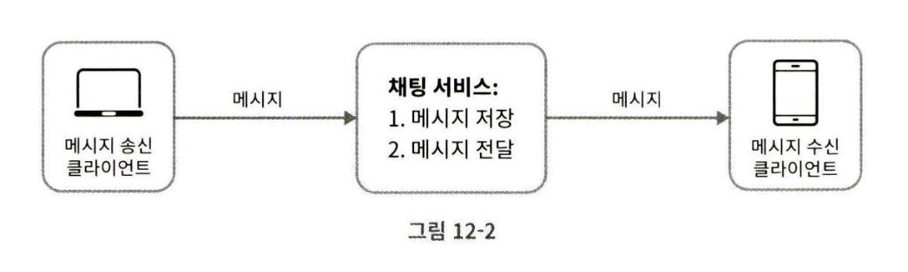

채팅을 시작하려는 클라이언트는 네트워크 통신 프로토콜을 사용하여 서비스에 접속한다. 

어떤 통신 프로코콜을 사용할 것인가는 중요한 문제이므로 면접관과의 상의가 필요하다.

메시지 송신 클라이언트(sender)가 HTTP를 통해 채팅 서비스에 메시지를 수신자에게 전달하라고 알린다.  
채팅 서비스와의 접속에는 keep-alive 헤더를 사용하면 효율적인데, 클라이언트와 서버 사이의 연결을 끊지 않아 TCP 접속 과정에서 발생하는 핸드셰이크 횟수도 줄일 수 있다.

메시지 수신 시나리오는 좀 더 복잡한데, HTTP는 서버에서 클라이언트로 임의 시점에 메시지를 보내는데 쉽게 쓰일 수 없기 때문이다.

서버가 연결을 만드는 것처럼 동작할 수 있도록 하기 위해
- 폴링
- 롱 폴링
- 웹 소켓

등의 기법이 제안되어 왔다.

### 폴링
클라이언트가 주기적으로 서버에게 새 메시지가 있느냐고 물어보는 방법이다.

폴링을 자주하면 할수록 비용이 올라간다.  
답해줄 메시지가 없으면 서버 자원이 불필요하게 낭비된다.

### 롱 폴링

클라이언트는 새 메시지가 반환되거나 타임아웃 될 때까지 연결을 유지한다.

새 메시지를 받으면 기존 연결을 종료하고 서버에 새로운 요청을 보내어 모든 절차를 다시 시작한다.

폴링보다는 효율적이지만 다음과 같은 단점이 있다.
- 메시지를 보내는 클라이언트와 수신하는 클라이언트가 같은 채팅 서버에 접속하게 되지 않을 수도 있다.

    HTTP 서버들은 보통 무상태 서버다. 로드밸런싱을 위해 라운드 로빈 알고리즘을 사용하는 경우, 메시지를 받은 서버는 해당 메시지를 클라이언트와의 롱 폴링 연결을 가지고 있지 않은 서버일 수 있는 것이다.

- 서버 입장에서는 클라이언트가 연결을 해제했는지 아닌지 알 좋은 방법이 없다.

- 여전히 비효율적이다. 메시지를 많이 받지 않는 클라이언트도 타임아웃이 일어날 때마다 주기적으로 서버에 다시 접속할 것이다.

### 웹소켓

서버가 클라이언트에게 비동기(async) 메시지를 보낼 때 가장 널리 사용하는 기술이다.

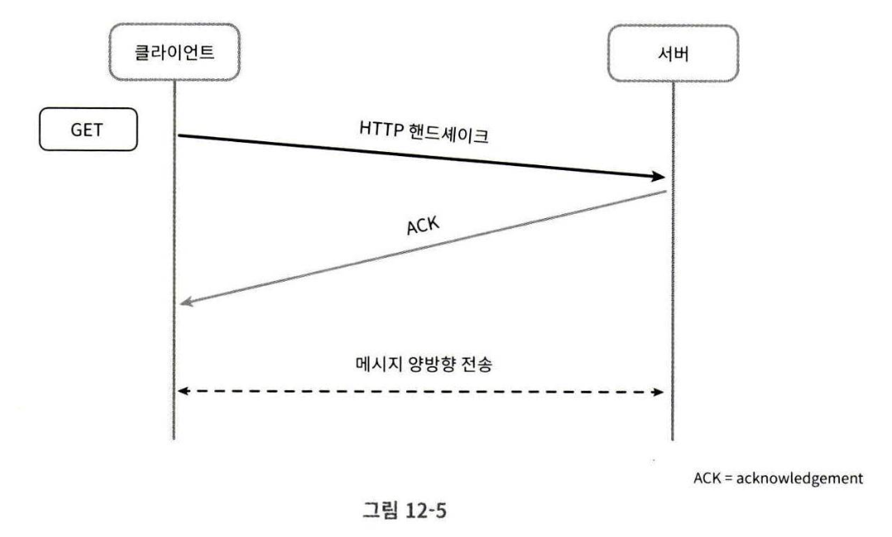

웹소켓 연결은 클라이언트가 시작한다.  
한번 맺어진 연결은 영구적이며, 양방향이다.  
이 연결은 처음에는 HTTP 연결이지만 특정 핸드셰이크 절차를 거쳐 웹소켓 연결로 업그레이드된다.

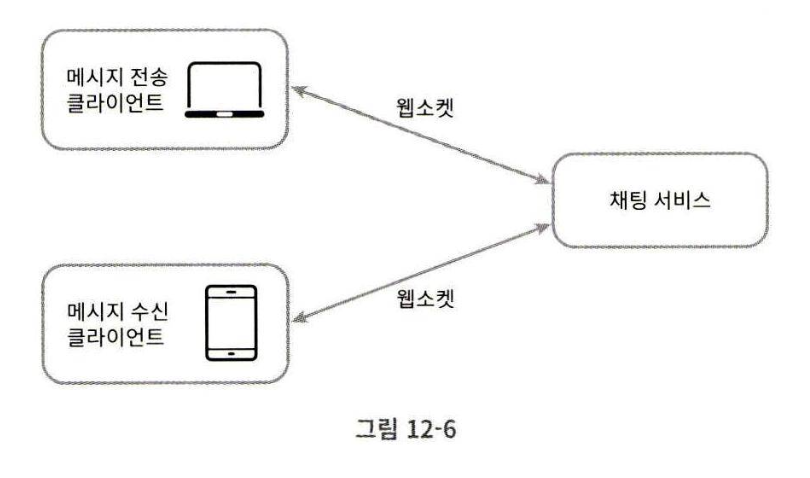

웹소켓을 이용하면 메시지를 보낼 때나 받을 때 동일한 프로토콜을 사용할 수 있으므로 설계뿐 아니라 구현도 단순하고 직관적이다.

### 개략적 설계안

사실 대부분의 기능(회원가입, 로그인, 사용자 프로파일 등)은 일반적인 HTTP 상에서 구현해도 된다.

#### 무상태 서비스

로그인, 회원가입, 사용자 프로파일 표시 등을 처리하는 전통적인 요청/응답 서비스다.

무상태 서비스는 로드밸런서 뒤에 위치한다.

로드밸런서 뒤에 오는 서비스는 모놀리틱 서비스일 수도 있고, 마이크로 서비스일 수도 있다.

#### 상태 유지 서비스

본 설계안에서 상태 유지가 필요한 서비스는 채팅 서비스다.  
클라이언트는 보통 서버가 살아 있는 한 다른 서버로 연결을 변경하지 않는다.

#### 제3자 서비스 연동

푸시 알림

#### 규모 확장성

모든 것을 서버 한 대에서 담은 설계안을 내밀면 면접에서 좋은 점수를 받을 수 없다.

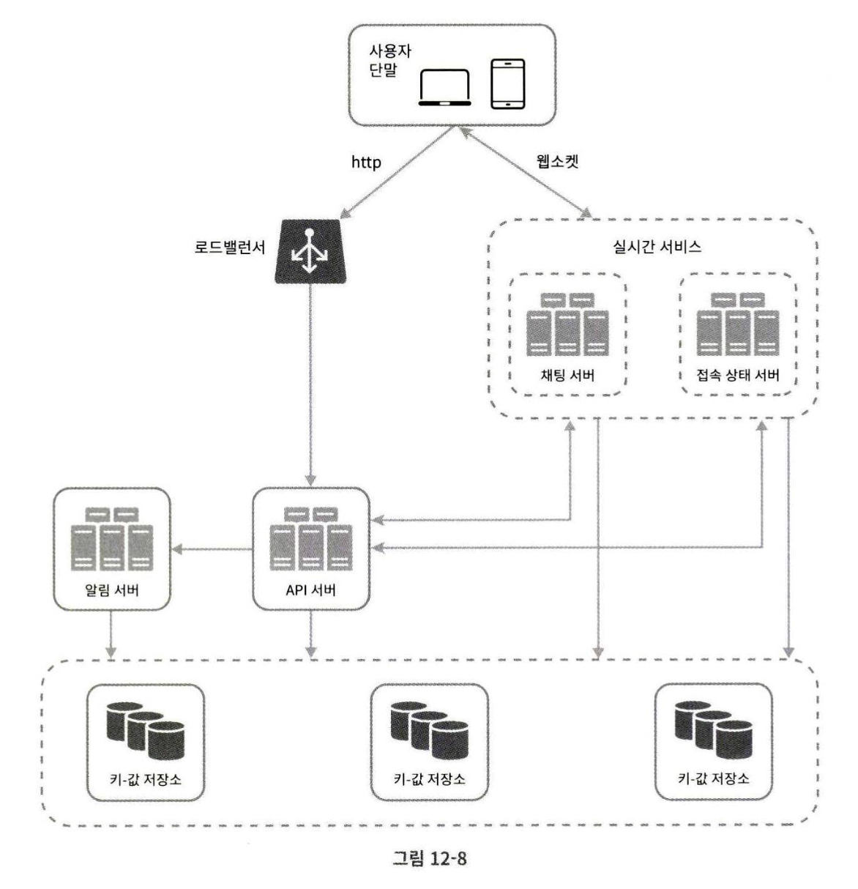

- 채팅 서버: 클라이언트 사이의 메시지 중계
- 접속 상태 서버(presence server): 사용자의 접속 여부 관리
- API 서버: 로그인, 회원가입, 프로파일 변경 등
- 알림 서버: 푸시 알림
- 키-값 저장소: 채팅 이력 보관

#### 저장소

1. 사용자 프로파일, 설정, 친구 목록 같은 일반 데이터

    이런 데이터는 안정성을 보장하기 위해 RDB에 보관한다.  
    다중화와 샤딩으로 가용성과 규모확장성을 보장한다.

2. 채팅 시스템에 고유한 데이터로, 채팅 이력(chat history)

    - 채팅 이력 데이터의 양은 엄청나다.
    - 이 데이터 가운데 빈번하게 사용되는 것은 최근에 주고 받은 메시지다.
    - 사용자는 검색 기능을 이용하거나, 특정 사용자가 언급된 메시지를 보거나, 특정 메시지로 점프하는 등 무작위적인 데이터 접근을 할 때도 있다. 데이터 계틍은 이런 기능도 지원해야 한다.
    - 1:1 채팅 앱의 경우 읽기:쓰기 비율은 대략 1:1 정도다.

이 두 데이터를 지원할 DB로 키-값 저장소를 사용
- 키-값 저장소는 수평적 규모확장이 쉽다.
- 데이터 접근 지연시간이 낮다.
- RDB는 데이터 가운데 롱 테일에 해당하는 부분을 잘 처리하지 못하는 경향이 있다.

    인덱스가 커지면 데이터에 대한 random access를 처리하는 비용히 늘어난다.

#### 데이터 모델

##### 1:1 채팅을 위한 메시지 테이블

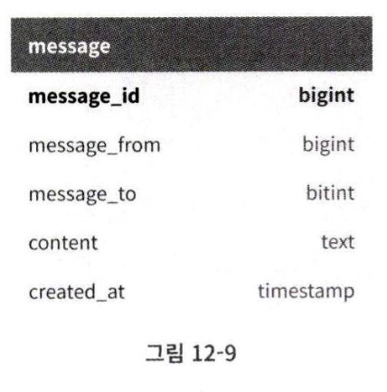

##### 그룹 채팅을 위한 메시지 테이블

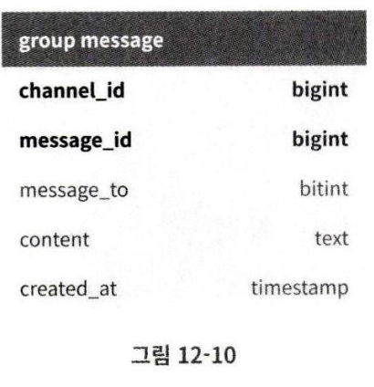

##### 메시지 ID

- message_id의 값은 고유해야 한다.
- ID 값은 정렬 가능해야 하며, 시간 순서와 일치해야 한다.

NoSQL은 auto_increment를 지원하지 않는다.

스노플레이크 같은 전역적 64-bit 순서 번호 생성기를 이용할 수 있고,  
지역적 순서 번호 생성기(local sequence number generator)를 이용할 수 있다.

ID의 유일성은 같은 그룹 안에서만 보증하면 충분하다는 것이다.  
메시지 사이의 순서는 같은 채널 혹은 같은 1:1 채팅 세션 안에서만 유지되면 된다.

## 3단계 상세 설계

### 서비스 탐색

서비스 탐색 기능의 주된 역할은 클라이언트에게 가장 적합한 채팅 서버를 추천하는 것이다.

이때 기준으로는 클라이언트의 위치, 서버의 용량 등이 있다.

서비스 탐색 기능을 구현하는데 널리 쓰이는 오픈 소스 솔루션으로는 아파치 주키퍼 같은 것이 있다.

사용 가능한 모든 채팅 서버를 여기 등록시켜 두면 클라이언트가 접속을 시도할 때 사전에 정한 기준에 따라 최적의 채팅 서버를 골라준다.

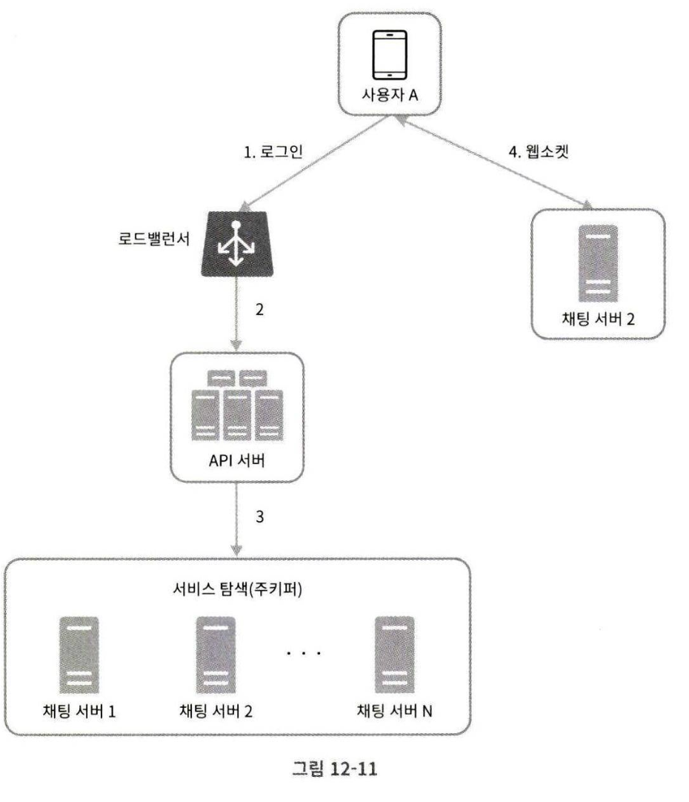

### 메시지 흐름

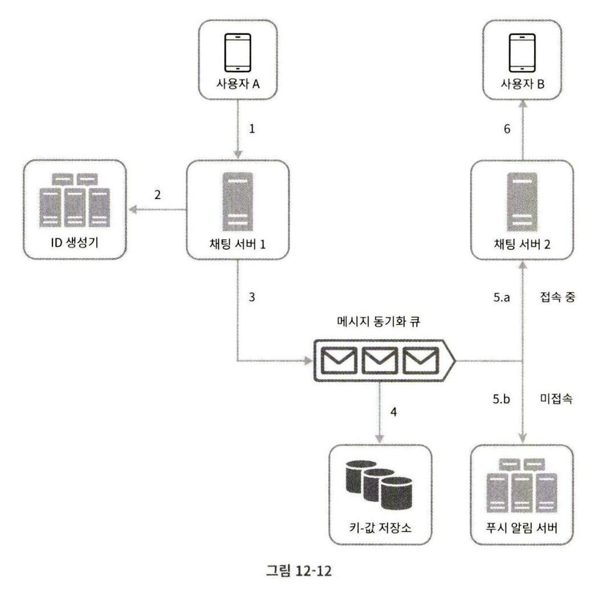

#### 1:1 채팅 메시지 처리 흐름

1. 사용자 A가 채팅 서버 1로 메시지 전송
2. 채팅 서버 1은 ID 생성기를 사용해 해당 메시지의 ID 결정
3. 채팅 서버 1은 해당 메시지를 메시지 동기화 큐로 전송
4. 메시지가 키-값 저장소에 보관됨
5. 
    1. 사용자 B가 접속중인 경우 메시지는 사용자 B가 접속 중인 채팅 서버로 전송됨

    2. 사용자 B가 접속 중이 아니라면 푸시 알림 메시지를 푸시 알림 서버로 보냄
6. 채팅 서버 2는 메시지를 사용자 B에게 전송. 사용자 B와 채팅 서버 2 사이에는 웹소켓 연결이 있는 상태이므로 그것을 이용

#### 여러 단말 사이의 메시지 동기화

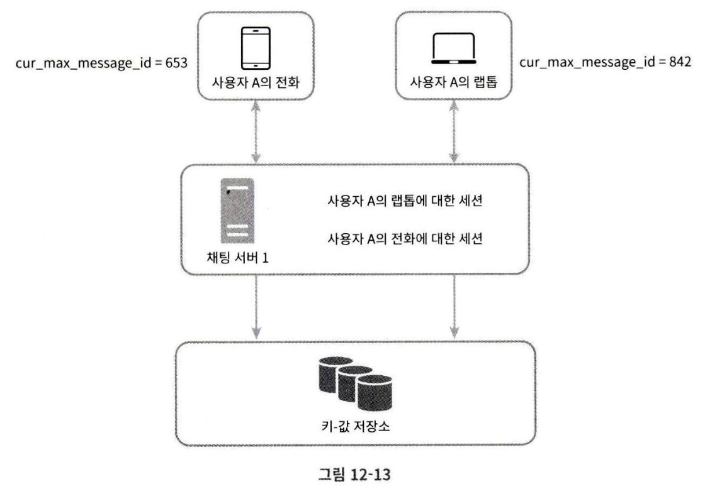

사용자 A는 전화가와 랩탑 두 대 단말을 이용하고 있다.  
두 기기 다 채팅 서버 1에 연결되어 있다.

각 단말은 cur_max_message_id 라는 변수를 유지하는데, 해당 단말에서 관측된 가장 최신 메시지의 ID를 추적하는 용도다.

아래 두 조건을 만족하는 메시지는 새 메시지로 간주된다.
- 수신자 ID가 현재 로그인한 사용자 ID와 같다.
- 키-값 저장소에 보관된 메시지로서, 그 ID가 cur_max_message_id보다 크다.

#### 소규모 그룹 채팅에서의 메시지 흐름

1:1 채팅에 비해 메시지 흐름이 복잡하다.

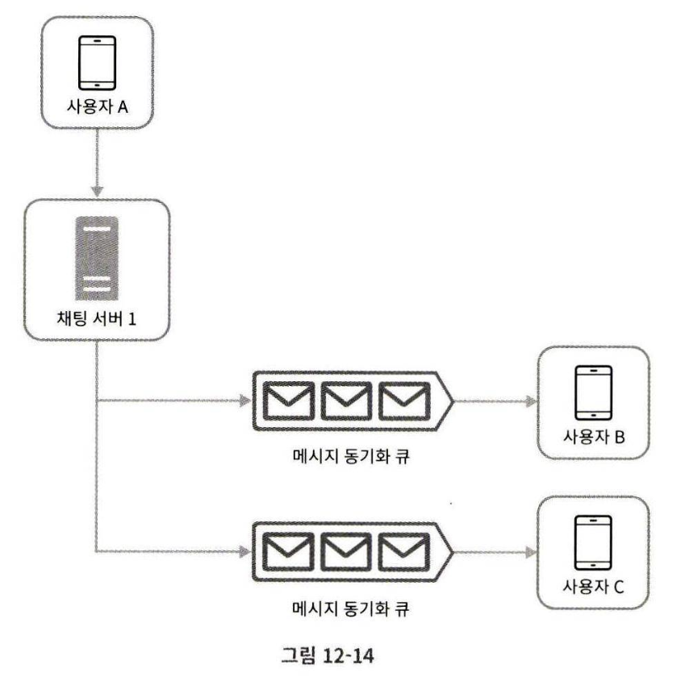

사용자 A가 보낸 메시지가 사용자 B와 C의 메시지 동기화 큐(message sync queue)에 복사된다.

이 설계는 소규모 그룹 채팅에 적합한데,
- 새로운 메시지가 왔는지 확인하려면 자기 큐만 보면 되니까 메시지 동기화 플로가 단순하다.
- 그룹이 크지 않으면 메시지를 수신자별로 복사해서 큐에 넣는 작업의 비용이 문제가 되지 않는다.

한편, 수신자 관점에서 보면, 한 수신자는 여러 사용자로부터 오는 메시지를 수신할 수 있어야 한다.

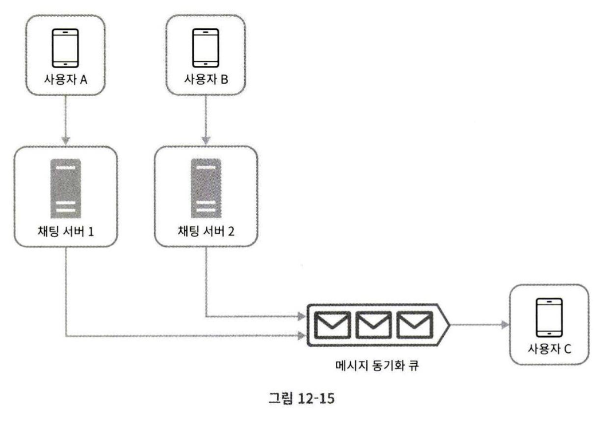

각 사용자의 수신함, 메시지 동기화 큐는 여러 사용자로부터 오는 메시지를 받을 수 있어야 한다.

### 접속상태 표시

#### 사용자 로그인
클라이언트와 실시간 서비스 사이에 웹소켓 연결이 맺어지고 나면 접속상태 서버는 A의 상태와 last_active_at 타임스탬프 값을 키-값 저장소에 보관한다.

그러면 해당 사용자는 접속 중인 것으로 표시될 것이다.

#### 로그아웃
키-값 저장소에 보관된 사용자 상태가 online에서 offline으로 바뀌고, UI 상에서 사용자의 상태는 접속 중이 아닌 것으로 표시될 것이다.

#### 접속 장애

가장 간단한 방법은 사용자를 오프라인 상태로 표시하고 연결이 복구되면 온라인 상태로 변경하는 것이다.

하지만 짧은 시간 동안 인터넷 연결이 끊어졌다 복구되는 일은 흔하다.  
이런 일이 벌어질 때마다 사용자의 접속 상태를 변경한다면 지나친 일이고, 사용자 경험 측면에서도 바람직하지 않다.

온라인 상태의 클라이언트가 주기적으로 박동 이벤트를 접속 상태 서버로 보내도록 하고, 마지막 이벤트를 받은 지 x초 이내에 또 다른 박동 이벤트 메시지를 받으면 해당 사용자의 접속 상태를 계속 온라인으로 유지하는 것이다.

#### 상태 정보의 전송

사용자 A와 친구 관계에 있는 사용자들은 해당 사용자의 상태 변화를 어떻게 알게되는가?

상태 정보 서버는 발행-구독 모델(publish-subscribe model)을 사용하는데, 각각의 친구 관계마다 채널을 하나씩 두는 것이다.

이렇게 하면 친구 관계에 있는 사용자가 상태 정보 변화를 쉽게 통지 받을 수 있다.

하지만 이런 방법은 그룹 크기가 작을 때 효과적이고, 그룹 크기가 커지면 사용자가 그룹 채팅에 입장하는 순간에만 상태 정보를 읽어가게 하거나 친구 리스트에 있는 사용자의 접속 상태를 갱신하고 싶으면 수동으로 하도록 유도해야 한다.