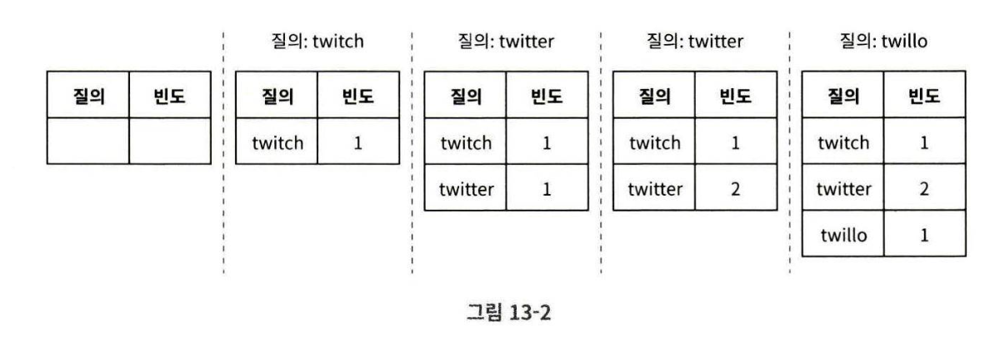
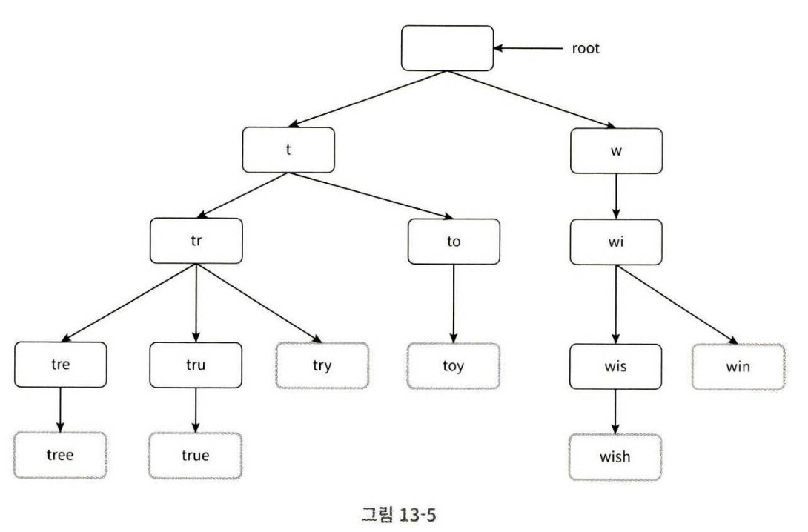
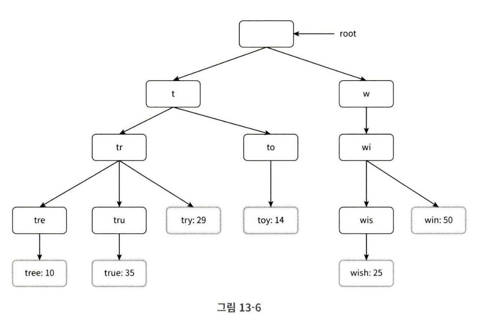
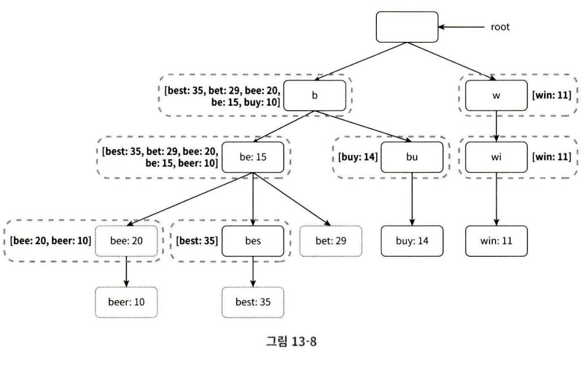
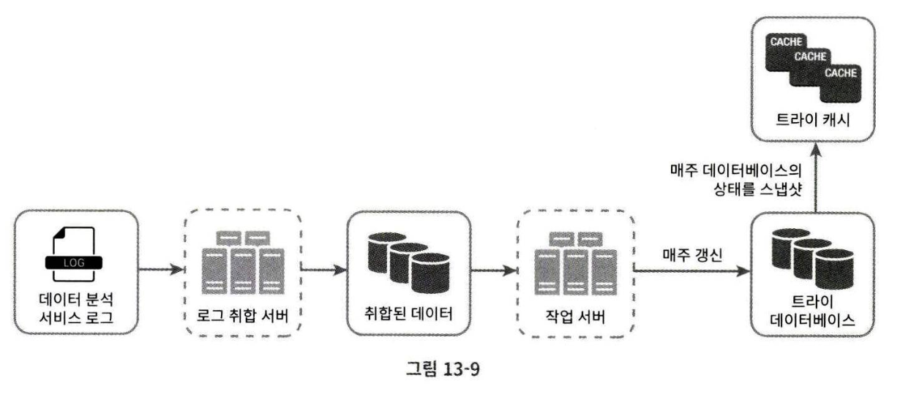
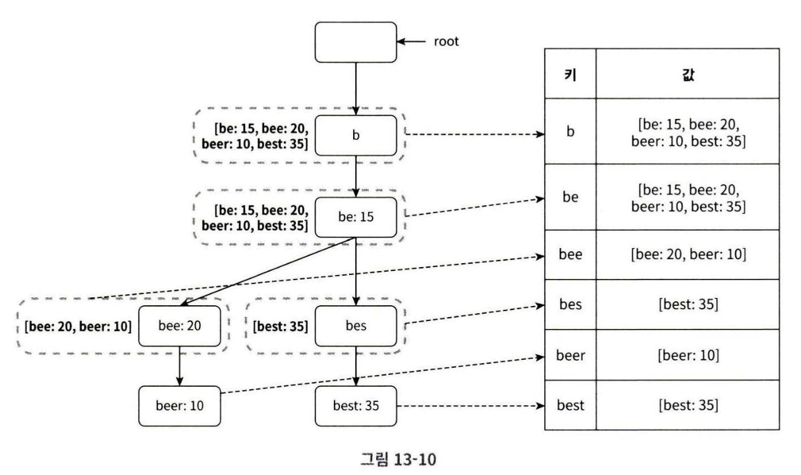
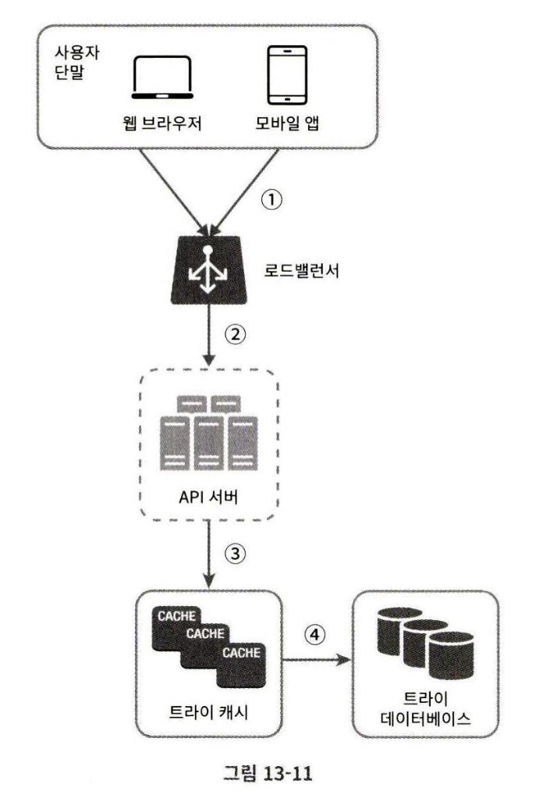

# 13장 검색어 자동완성 시스템

autocomplete, typeahead, search-as-you-type, incremental search 등 으로 불린다.

## 1단계 문제 이해 및 설계 범위 확정

Q. 사용자가 입력하는 단어는 자동완성될 검색어의 첫 부분이어야 하나요? 중간 부분이어도 되나요?  
A. 첫 부분으로 한정하겠습니다.

Q. 몇 개가 표시되어야 하나요?  
A. 5개

Q. 자동완성 검색어 5개는 무슨 기준인가요  
A. 검색어 질의 횟수(인기순위)

Q. 맞춤법 검사는?  
A. 안해도 됨

Q. 단어는 영어인가요?  
A. 네. 시간 남으면 다국어 ㄱㄱ

Q. 대문자나 특수문자는?  
A. 영어 소문자만 생각 ㄱㄱ

Q. 사용자는?  
A. DAU 천만명

### 요구사항 정리
- 빠른 응담 속도: 사용자가 검색어를 입력하면 100ms 이내로 자동완성 검색어도 표시되어야 함
- 연관성: 자동완성되어 출력되는 검색어는 사용자 입력 단어와 연관된 것이어야 함
- 정렬: 시스템의 계산 결과는 인기도 등의 순위 모델에 의해 정렬되어있어야 함
- 규모 확장성: 많은 트래픽을 감당할 수 있도록 확장 가능해야 함
- 고가용성: 시스템의 일부에 장애가 생겨도 시스템은 계속 사용 가능해야 함

### 개략적 규모 추정
- 일간 능동 사용자는 천만명
- 평균적으로 한 사용자는 매일 10건의 검색 수행
- 질의마다 평균 20바이트의 데이터를 입력한다고 가정(4개 단어, 단어는 평균적으로 5글자로 구성된다고 가정)
- 검색창에 글자를 입력할 때마다 백엔드에 요청을 보냄
- QPS 24000
- 최대 QPS 48000
- 질의 가운데 20%는 신규 검색어, 매일 0.4GB의 신규 데이터가 시스템에 추가된다고 가정

## 2단계 개략적 설계안 제시 및 동의 구하기

1. 데이터 수집 서비스(data gathering service)

    사용자가 입력한 질의를 실시간으로 수집하는 시스템  
    데이터가 많은 애플리케이션에 실시간 시스템은 바람직하지 않지만 출발점으로 적절

2. 질의 서비스(query service)

    주어진 질의에 다섯 개의 인기 검색어를 정렬해 내놓는 서비스

### 데이터 수집 서비스

질의문과 사용빈도를 저장하는 빈도 테이블(frequency table)이 있다고 가정  
사용자가 twitch, twitter, twitter, twillo를 검색하면


### 질의 서비스

가장 많이 사용된 5개 검색어 쿼리는 다음과 같을 것이다.
``` sql
SELECT * FROM frequency_table
WHERE query LIKE 'prefix%'
ORDER BY frequency DESC
LIMIT 5
```

하지만 데이터가 많아지면 DB에 병목이 생길 수 있다.

## 3단계 상세 설계
몇 개의 컴포넌트를 골라 상세 설계

- 트라이(trie) 자료구조
- 데이터 수집 서비스
- 질의 서비스
- 규모 확장이 가능한 저장소
- 트라이 연산

### 트라이 자료구조
트라이는 문자열들을 간략하게 저장할 수 있는 자료구조다.  
"retrieval" 이라는 단어에서 온 것

- 트라이는 트리 형태의 자료구조
- 루트 노드는 빈 문자열을 나타냄
- 각 노드는 글자 하나를 저장, 26개의 자식 노드를 가질 수 있음
- 각 트리 노드는 하나의 단어 또는 접두어 분자열을 나타냄

'tree', 'try', 'true', 'toy', 'wish', 'win'이 보관된 트라이


| query | frequency |
|-------|-----------|
| tree  | 10        |
| try   | 29        |
| true  | 35        |
| toy   | 14        |
| wish  | 25        |
| win   | 50        |

이 테이블에 담긴 내용을 트라이에 저장하면


가장 많이 사용된 질의어 k개는 다음과 같이 찾을 수 있다.
※ p: 접두어의 길이, n: 트라이 안에 있는 노드 개수, c: 주어진 노드의 자식 노드 개수

1. 해당 접두어를 표현하는 노드 탐색, O(p)
2. 해당 노드부터 시작하는 하위 트리를 탐색하여 모든 유효 노드를 찾는다. O(c)
3. 유효 노드들을 정렬하여 가장 인기 있는 검색어 k개를 찾는다. O(clogc)

단, 최악의 경우 k개의 결과를 얻기 위해 전체 트라이를 다 검색해야 할 일이 생길 수 있다.

해결법:  
1. 접두어의 최대 길이를 제한
2. 각 노드에 인기 검색어를 캐시

#### 접두어 최대 길이 제한
사용자가 검색창에 긴 검색어를 입력하는 일이 거의 없기 때문에 p를 50같은 작은 정숫값으로 제한해도 안전하다.

O(p) -> O(1)

#### 노드에 인기 검색어 캐시

각 노드에 k개의 인기 검색어를 저장해 두면 전체 트라이를 검색하는 일을 방지할 수 있다.  
하지만 각 노드에 질의어를 저장할 공간이 많이 필요하게 된다.

개선된 트라이 구조


1. 접두어 노드를 찾는 시간 복잡도가 O(1)이 됨
2. 최고 인기 검색어 5개를 찾는 질의의 시간 복잡도가 O(1)이 됨

### 데이터 수집 서비스

- 사용자가 타이핑을 할 때마다 트라이를 갱신하면 질의 서비스는 심각하게 느려질 것
- 트라이가 만들어지고 나면 인기 검색어는 그다지 자주 바뀌지 않을 것이다.

트라이를 만드는 데이터는 보통 데이터 분석 서비스나 로깅 서비스로부터 올 것이기 때문에 다음처럼 설계를 수정할 수 있다.



#### 데이터 분석 서비스 로그

로그 파일 예시

| query | time                |
|-------|---------------------|
| tree  | 2019-10-01 22:01:01 |
| try   | 2019-10-01 22:01:05 |
| tree  | 2019-10-01 22:01:30 |
| toy   | 2019-10-01 22:02:22 |
| tree  | 2019-10-02 22:02:42 |
| try   | 2019-10-03 22:03:03 |

#### 로그 취합 서버

트위터 같은 실시간 애플리케이션의 경우 결과를 빨리 보여주는 것이 중요하므로 데이터 취합 주기를 짧게 가져갈 필요가 있다.

대부분의 경우에는 일주일에 한 번 정도면 좋을 듯

#### 취합된 데이터
| query | time       | frequency |
|-------|------------|-----------|
| tree  | 2019-10-01 | 12000     |
| tree  | 2019-10-08 | 15000     |
| tree  | 2019-10-15 | 9000      |
| toy   | 2019-10-01 | 8500      |
| toy   | 2019-10-08 | 6256      |
| toy   | 2019-10-15 | 8866      |

#### 작업 서버
주기적으로 비동기적 작업을 실행하는 서버 집합.  
트라이 자료구조를 만들고 트라이 데이터베이스에 저장

#### 트라이 캐시

1. 문서 저장소: 

    새 트라이를 매주 만들어야 하므로 주기적으로 트라이를 직렬화하여 몽고디비 같은 문서 저장소를 활용하면 편하게 저장할 수 있다.

2. 키-값 저장소: 

    테이블 형태로 변환
    - 트라이에 보관된 모든 접두어를 해시 테이블 키로 변환
    - 각 트라이 노드에 보관된 모든 데이터를 해시 테이블 값으로 변환
    

### 질의 서비스
개략적 설계안에서 살펴본 질의 서비스는 비효율적이다.  
아래 그림은 비효율성을 개선한 설계다.


1. 검색 질의가 로드밸런서로 전송됨
2. 로드밸런서는 질의를 API 서버로 보낸다.
3. API 서버는 트라이 캐시에서 데이터를 가져와 자동완성 응답을 구성
4. 데이터가 트라이 캐시에 없으면 데이터를 DB에서 가져와 캐시에 채운다.

다음과 같은 추가 최적화 방안이 있다.
- AJAX 요청: 웹 애플리케이션의 경우 브라우저는 보통 AJAX 요청을 보낸다. 요청을 보내고 받기 위해 페이지를 새로고침 할 필요가 없다.
- 브라우저 캐싱: 대부분의 애플리케이션의 경우 자동완성 검색어 제안 결과는 짧은 시간 안에 자주 바뀌지 않는다. 검색어들을 브라우저 캐시에 넣어두면 후속 질의 결과는 해당 캐시에서 바로 가져갈 수 있다. 