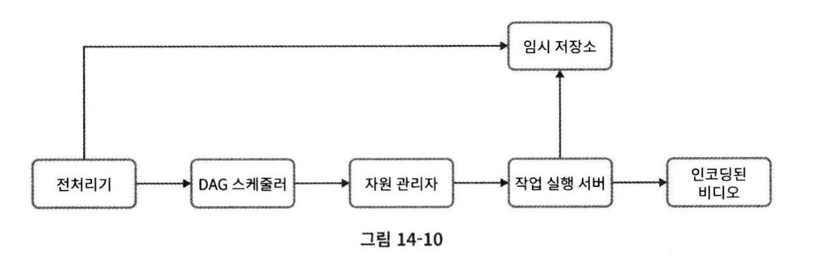
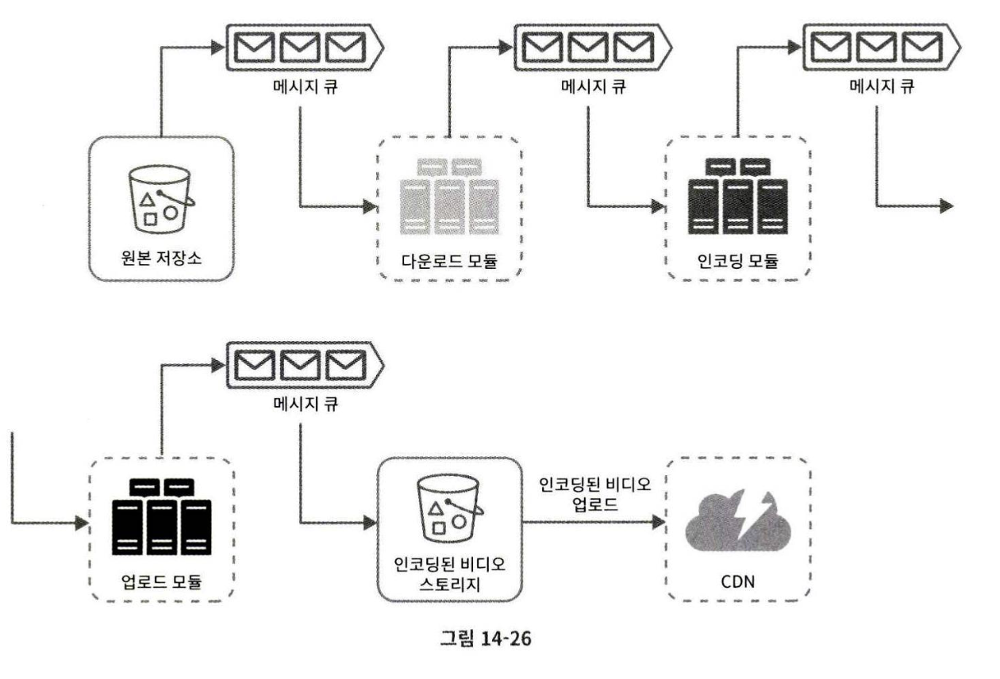

# 14장 유튜브 설계

유튜브 관련 통계 자료
- 월간 능동 사용자 수: 20억
- 매일 재생되는 비디오 수: 50억
- 미국 성인 가운데 73%가 유튜브 이용
- 5천만명의 창작자
- 유튜브 광고 수입은 19년 기준 150억 달러(18년 대비 36% 증가)
- 80개 언어 지원

## 1단계 문제 이해 및 설계 범위 확정
댓글, 비디오 공유, 좋아요, 재생목록에 동영상 추가, 채널 구독 등의 많은 기능이 있기 때문에 적절한 질문으로 설계 범위를 좁혀야 한다.

Q. 가장 중요한 기능?  
A. 비디오를 올리고 시청

Q. 어떤 클라이언트 지원?  
A. 모바일 앱, 웹 브라우저, 스마트TV

Q. 일간 능동 사용자?  
A. 5백만

Q. 사용자가 평균적으로 소비하는 시간?  
A. 30분

Q. 다국어 지원?  
A. 필요함.

Q. 지원하는 비디오 해상도?  
A. 현존하는 비디오 종류, 해당도 대부분

Q. 암호화?  
A. 필요함.

Q. 비디오 파일 크기 제한?  
A. 1GB로 제한 ㄱㄱ

Q. 클라우드 서비스 활용해도 되나  
A. 좋다.

### 요구사항 정리
- 빠른 비디오 업로드
- 원활한 비디오 재생
- 재생 품질 선택 가능
- 낮은 인프라 비용
- 높은 가용성과 규모 확장성, 안정성
- 지원 클라이언트: 모바일 앱, 웹 브라우저, 스마트 TV

### 개략적 규모 추정
- DAU 5백만
- 사용자는 하루에 평균 5개의 동영상 시청
- 10% 사용자가 하루에 1비디오 업로드
- 비디오 평균 크기는 300MB
- 매일 150TB 필요
- CDN 사용시 매일 150,000$ 필요

## 2단계 개략적 설계안 제시 및 동의 구하기
CDN과 BLOB 스토리지는 이미 존재하는 클라우스 서비스를 활용

비디오를 CDN 서버에 저장, 재생 버튼을 누르면 CDN으로부터 스트리밍  
API 서버는 피드 추천, 비디오 업로드 URL 생성, 메타데이터 DB와 캐시 갱신, 사용자 가입등을 처리

### 비디오 업로드

- 사용자: 컴퓨터, 모바일, 스마트TV를 사용
- 로드밸런서
- API 서버: 비디오 스트리밍 제외한 모든 요청 처리
- 메타데이터 데이터베이스: 비디오의 메타데이터 보관, 샤딩, 다중화 적용
- 메타데이터 캐시: 비디오 메타데이터와 사용자 객체를 캐시
- 원본 저장소: 비디오를 보관할 대형 이진 파일 저장소(BLOB, Binary Large Object storage)
- 트랜스코딩 서버: 비디오 인코딩을 수행, 비디오의 포맷을 변환. 단말이나 대역폭 요구사항에 맞는 비디오 스트림 제공을 위해 필요
- 트랜스코딩 비디오 저장소: 트랜스코딩이 완료된 비디오를 저장하는 BLOB 저장소
- CDN: 비디오를 캐시
- 트랜스코딩 완료 큐
- 트랜스코딩 완료 핸들러: 트랜스코딩 완료 큐에서 이벤트 데이터를 꺼내 메타데이터 캐시와 DB를 갱신

#### 비디오 업로드
1. 비디오를 원본 저장소에 업로드
2. 트랜스코딩 서버는 원본 저장소에서 해당 비디오를 가져와 트랜스코딩을 시작
3. 트랜스코딩이 완료되면 아래 두 절차가 병렬 수행됨.

    3a. 완료된 비디오를 트랜스코딩 비디오 저장소로 업로드  
    3b. 트랜스코딩 완료 이벤트를 트랜스코딩 완료 큐에 넣는다.

        1. 트랜스코딩이 끝난 비디오를 CDN에 올린다.  
        2. 완료 핸들러가 이벤트 데이터를 큐에서 꺼낸다.  
        3. 완료 핸들러가 메타데이터 DB와 캐시를 갱신한다.

4. API 서버가 단말에게 비디오 업로드가 끝나 스트리밍 준비가 완료되었음을 알림

#### 메타데이터 갱신
원본 저장소에 파일이 업로드되는 동안, 단말은 병렬적으로 비디오 메타데이터 갱신 요청을 API 서버에 보낸다.

메타데이터에는 파일 이름, 크기, 포맷 등의 정보가 들어있다.

### 비디오 스트리밍

대표적인 스트리밍 프로토콜
- MPEG-DASH: Moving Picture Experts Group - Dynamic Adaptive Streaming over HTTP
- 애플 HLS
- Microsoft Smooth Streaming
- 어도비 HTTP Dynamic Streaming, HDS

비디오는 CDN에서 바로 스트리밍되며, 사용자의 단말에 가장 가까운 엣지 서버가 비디오 전송을 담당

## 3단계 상세 설계

### 비디오 트랜스코딩
- 많은 단말과 브라우저는 특정 종류의 비디오 포맷만을 지원하므로 이 비디오가 다른 단말에서도 재생되려면 다른 단말과 호환되는 비트레이트와 포맷으로 저장되어야 한다.
- 또한 가공되지 않은 원본 비디오는 저장공간을 많이 차지
- 네트워크 대역폭이 충분하지 않은 사용자에게는 저화질, 대역폭이 충분한 사용자에게는 고화질 비디오를 보내는 것이 바람직하다.

인코딩 포멧은 두 부분으로 구성되어 있다.
- 컨테이너: 빋오 파일, 오디오, 메타데이터를 담는 바구니  
.avi, .mov, .mp4 등
- 코덱(codec): 압축 및 압축 해제 알고리즘  
H.264, VP9, HEVC 등

#### 유향 비순환 그래프(DAG) 모델

비디오 트랜스코딩은 컴퓨팅 자원과 시간이 많이 드는 작업이다.  
썸네일 추출, 고/저화질 변환, 워터마크 추가, 오디오 스트림 처리

여러 비디오를 처리하려면 각 작업의 순서와 병렬성을 관리해야 한다.

어떤 작업은 순차적으로, 어떤 작업은 병렬로 수행이 가능하기 때문에  
비디오 처리 모델에 유향 비순환 그래프 모델을 도입하면 태스크의 병렬성을 높일 수 있다.

#### 비디오 트랜스코딩 아키텍처

##### 전처리기
1. 비디오 분할: 비디오 스트림을 GOP(Group of Pictures)라는 단위로 분할. GOP는 특정 순서로 배열된 프레임 그룹이며, 독립적으로 재생이 가능하다.

2. DAG 생성

3. 데이터 캐시: 안정성을 높이기 위해 GOP와 메타데이터를 임시 저장소에 보관. 인코딩이 실패하면 시스템은 보관된 데이터를 활용해 인코딩 재개

##### DAG 스케줄러

DAG 그래프를 몇 개 단계로 분할한 후 각각을 자원 관리자의 작업 큐에 넣는다.

##### 자원 관리자

- 작업 큐: 실행할 작업이 보관된 우선순위 큐
- 작업 서버 큐: 작업 서버의 가용 상태 정보가 담긴 우선순위 큐
- 실행 큐: 실행 중인 작업 및 작업 서버 정보 저장된 큐
- 작업 스케줄러: 최적의 작업/서버 조합을 골라, 해당 작업 서버가 작업을 수행하도록 지시

##### 작업 실행 서버

워터마크 삽입, 인코딩, 썸네일 추출, 병합 등의 작업을 처리한다.

##### 임시 저장소

저장할 데이터의 유형, 크기, 이용 빈도, 데이터 유효기간 등을 고려

예를 들어 메타데이터는 메모리에 캐시, 비디오/오디오 데이터는 BLOB 저장소가 적절

비디오 프로세싱이 완료되면 데이터 삭제

### 시스템 최적화

#### 속도 최적화: 비디오 병렬 업로드

비디오를 GOP으로 분할하여 GOP를 병렬적으로 업로드하면 일부가 실패해도 업로드를 재개할 수 있다.

단말에서 비디오를 GOP 경계에 맞게 분할하여 업로드하면 속도를 높일 수 있다.

#### 속도 최적화: 업로드 센터를 사용자 근거리에 지정

업로드 센터를 여러 곳에 두어 사용자가 지리적으로 가까운 센터에 비디오를 업로드 하도록 한다.

이 설계에서는 이를 위해 CDN을 업로드 센터로 활용

#### 속도 최적화: 모든 절차를 병렬화

메시지 큐를 도입하여 인코딩 모듈은 다운로드 모듈의 작업이 끝날 때까지 기다리지 않아도 된다.

#### 안전성 최적화: presigned URL

허가받은 사용자만이 올바른 장소에 비디오를 업로드 할 수 있도록 presigned URL을 이용한다.

1. 클라이언트는 HTTP 서버에 POST 요청으로 presigned URL을 받는다.
2. API서버는 presigned URL을 돌려준다.
3. 클라이언트는 해당 URL이 가리키는 위치에 비디오를 업로드한다.

#### 안전성 최적화: 비디오 보호
- 디지털 저작권 관리(DRM: Digital Rights Management) 시스템 도입: 애플의 FairPlay, 구글의 Widevine, MS의 PlayReady
- AES 암호화: 허용된 사용자만 암호화된 비디오를 시청할 수 있다.
- 워터마크: 비디오 위에 소유자 정보를 포함하는 이미지 오버레이를 올린다.

#### 비용 최적화

CDN은 비싸다.

연구 결과에 따르면 인기 비디오는 자주 실행되는 반면, 나머지는 거의 보는 사람이 없다.

1. 인기 비디오는 CND에, 나머지는 비디오 서버에 저장한다.
2. 인기가 별로 없는 비디오는 인코딩 할 필요가 없을 수도 있다.  
짧은 비디오라면 필요할 때 인코딩한다.
3. CDN을 직접 구축하고 ISP와 제휴한다.

### 오류 처리
- 업로드 오류: 재시도
- 비디오 분할 오류: 낡은 버전의 클라이언트가 GOP 경계에 따라 비디오를 분할하지 못한다면 전체 비디오를 서버로 전송하고, 서버가 비디오 분할을 처리
- 트랜스코딩 오류: 재시도
- 전처리 오류: DAG 그래프 재생성
- DAG 스케줄러 오류: 작업을 다시 스케줄링
- 자원관리자 큐에 장애 발생: 사본을 이용
- 작업 서버 장애: 다른 서버에서 해당 작업을 재시도
- API 서버 장애: API 서버는 무상태 서버이므로 신규 요청은 다른 API 서버로 우회될 것
- 메타데이터 캐시 서버 장애: 데이터가 다중화되어 있으므로 다른 노드에서 데이터를 가져올 수 있다.
- 메타데이터 DB 서버 장애: 주 서버가 죽은 경우 부 서버 중 하나를 승급, 부 서버가 죽었다면 죽은 서버를 새 것으로 교체

## 4단계 마무리
- API 계층의 규모 확장성 확보 방안
- DB 계층의 규모 확장성 확보 방안: 다중화와 샤딩
- 라이브 스트리밍
- 비디오 삭제: 부적절한 비디오