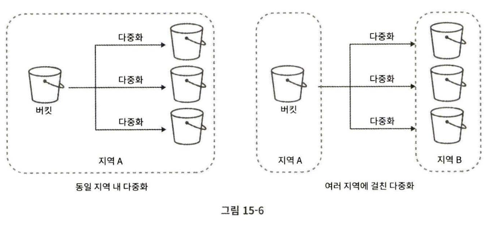
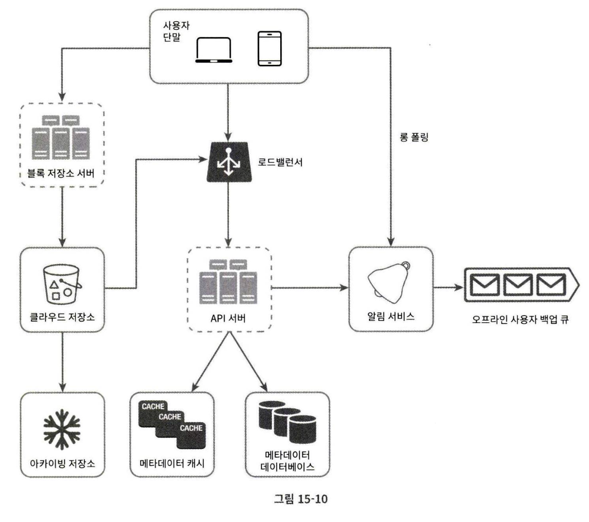
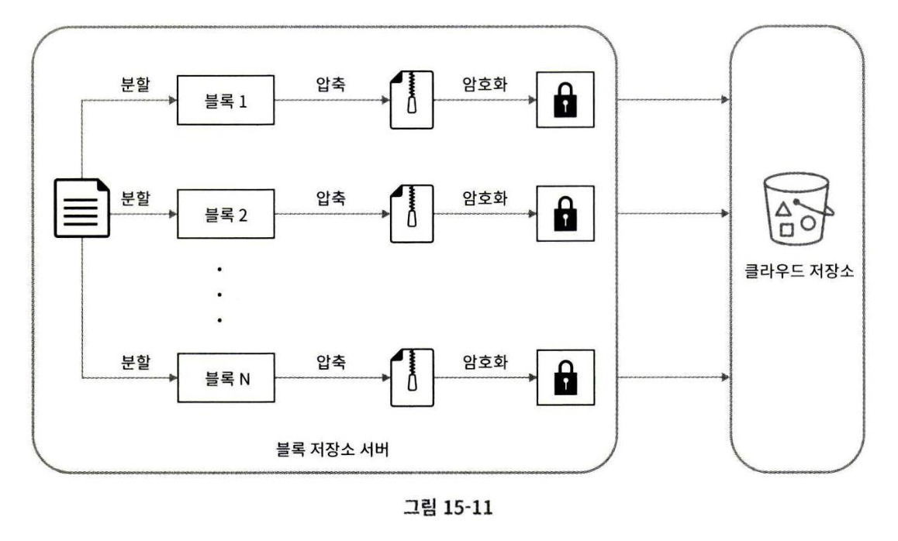
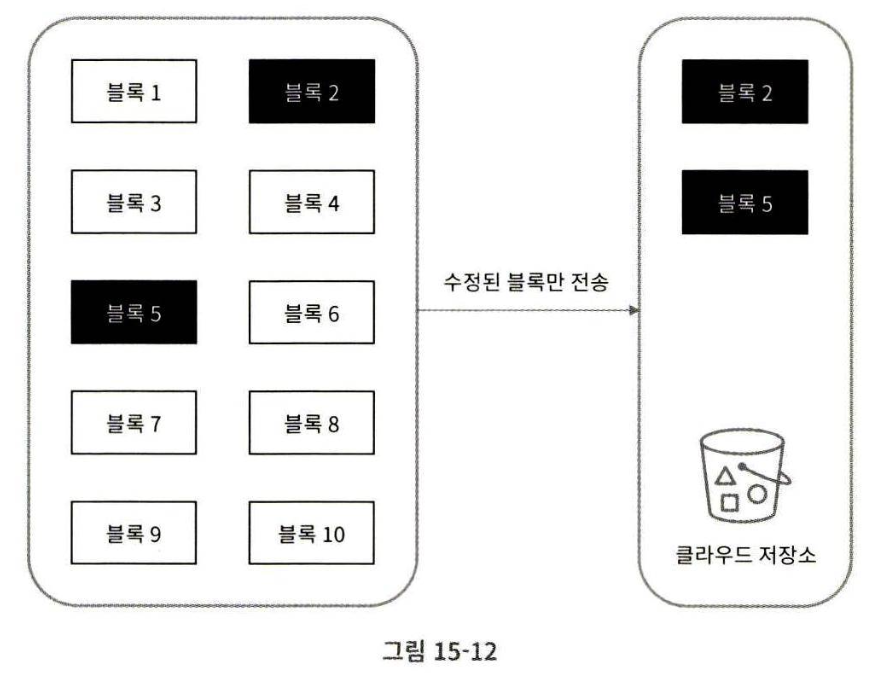
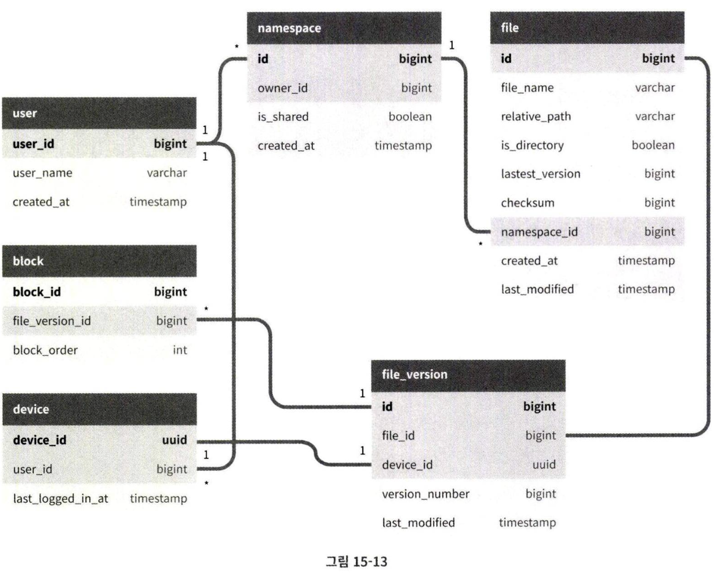
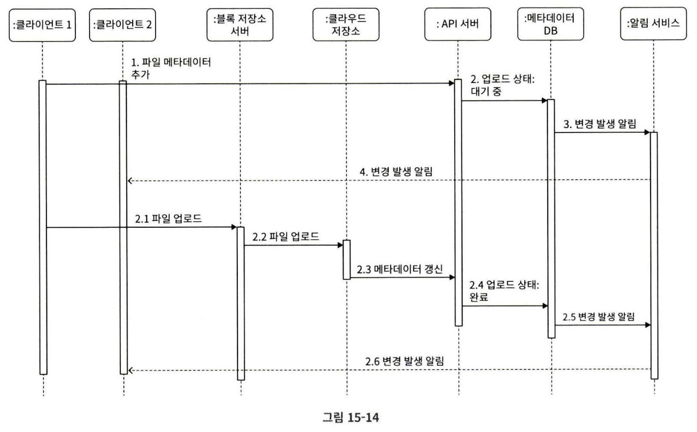
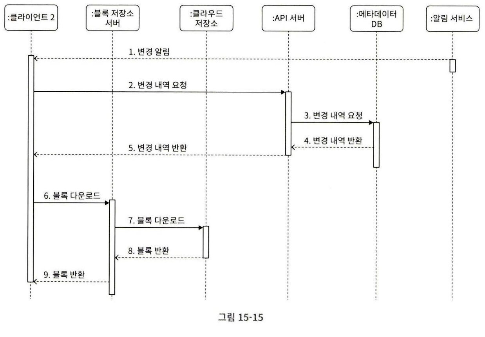

# 15장 구글 드라이브 설계

구글 드라이브는 파일 저장 및 동기화 서비스로, 문서, 사진, 비디오, 기타 파일을 클라우드에 보관할 수 있도록 한다.  
보관된 파일은 친구, 가족, 동료 들과 손쉽게 공유할 수 있어야 한다.

## 1단계 문제 이해 및 설계 범위 확정
구글 드라이브는 큰 프로젝트이므로, 질문을 통해 설계 범위를 좁혀야 한다.

Q. 가장 중요한 기능은 뭔가요  
A. 파일 업로드/다운로드, 파일 동기화, 그리고 알림 입니다.

Q. 모바일 앱, 웹 앱 둘 중 하나만 지원하면 될까요  
A. 둘 다 지원해야 합니다.

Q. 파일 암호화는 어떡하죠  
A. 해야죠.

Q. 파일 크기에 제한이 필요하겠죠?  
A. 10GB로 제한합시다.

Q. 사용자는 얼마나 됩니까?  
A. 일간 능동 사용자(DAU) 기준 천만명입니다.

### 필요한 기능
- 파일 추가
- 파일 다운로드
- 여러 단말에 파일 동기화(한 단말에서 파일을 추가하면 다른 단말에도 자동으로 동기화 되어야 함)
- 파일 갱신 이력 조회(revision history)
- 파일 공유
- 파일이 편집되거나 삭제되거나 새롭게 공유되었을 때 알림 표시

### 다루지 않을 기능
- 구글 문서 편집 및 협업 기능

### 비-기능적 욕사항
- 안정성: 저장소 시스템에서 안정성은 너무너무 중요하다. 데이터 손실은 있을 수 없다.
- 빠른 동기화 속도: 파일 동기화에 시간이 너무 많이 걸리면 사용자는 해당 제품을 사용하지 않을 것
- 네트워크 대역폭: 네트워크 대역폭을 불필요하게 많이 소모한다면 사용자의 데이터 사용량이 높아져 요금이 많이 나올 것
- 규모 확장성: 아주 많은 양의 트래피도 처리할 수 있어야 한다.
- 높은 가용성: 일부 서버에 장애가 발생하거나, 느려지거나, 네트워크 일부가 끊겨도 시스템은 계속 사용 가능해야 한다.

### 개략적 추정
- 가입 사용자는 오천만 명, DAU는 천만으로 가정
- 모든 사용자에게 10GB의 무료 저장공간 할당
- 매일 각 사용자가 평균 2개의 파일을 업로드, 각 파일의 크기는 500KB로 가정
- 읽기:쓰기 비율은 1:1
- 필요한 저장공간 = 5천만 사용자 x 10GB = 500PB
- 업로드 API QPS = 1천만 사용자 x 2회 업로드 / 24시간 / 3600초 = 약 240
- 최대 QPS = 480

## 2단계 개략적 설계안 제시 및 동의 구하기
우선 단일 서버로 설계하고 확장하는 방법을 사용하겠음

- 파일을 올리고 다운로드 하는 과정을 처리할 웹 서버
- 사용자 데이터, 로그인 정보, 파일 정보 등의 메타데이터를 보관할 DB
- 파일을 저장할 저장소 시스템. 파일 저장을 위해 1TB의 공간을 사용하겠다.

업로드되는 파일을 저장할 drive/ 디렉토리 준비.  
그 밑에 사용자 디렉토리를 두고, 각 사용자 디렉토리 안에 특정 사용자가 올린 파일을 보관하도록 하면 되겠다.

### API

1. 파일 업로드 API
- 단순 업로드: 파일 크기가 작을 때
- 이어 올리기(resumable upload): 파일 사이즈가 크고 네트워크 문제로 업로드가 중단될 가능성이 높다고 생각되면 사용  
`https://api.example.com/files/upload?uploadType=resumable`  

    인자
    - data: 업로드할 로컬 파일

    이어 올리기는 세 단계 절차로 이루어진다.
    1. 이어 올리기 URL을 받기 위한 최초 요청 전송
    2. 데이터를 업로드하고 업로드 상태 모니터링
    3. 업로드에 장애가 발생하면 장애 발생 시점부터 업로드를 재시작

2. 파일 다운로드 API
`https://api.example.com/files/download`

인자
- path: 다운로드할 파일의 경로

3. 파일 갱신 히스토리 API
`https://api.example.com/files/list_revisions`

인자
- path: 갱신 히스토리를 가져올 파일의 경로
- limit: 히스토리 길이의 최대치

### 한 대 서버의 제약 극복
업로드되는 파일이 많아지다 보면 결국에는 파일 시스템은 가득 차게 된다.

샤딩을 이용해 여러 서버에 나눠 저장하면 해결할 수 있겠지만, 서버에 장애가 생기면 데이터를 잃게 될 수 있다.

S3에 저장하기로 하자.  
S3는 다중화를 지원하는데, 여러 지역에 걸쳐 다중화하면 데이터 손실을 막고 가용성을 최대한 보장할 수 있으므로 그렇게 하기로 하자.

S3에 파일을 저장하니 데이터 손실을 걱정할 필요가 없어졌다.

다음과 같은 부분들을 추가적으로 개선할 수 있다.
- 로드밸런서: 네트워크 트래픽을 분산
- 웹 서버: 로드밸런서를 추가하고 나면 더 많은 웹 서버를 손쉽게 추가할 수 있다.
- 메타데이터 데이터베이스: 데이터베이스를 파일 저장 서버에서 분리하여 SPOF를 회피, 다중화와 샤딩을 적용하여 가용성과 규모 확장성 요구사항에 대응
- 파일 저장소: S3를 파일 저장소로 사용하고 가용성과 데이터 무손실을 보장하기 위해 두 개 이상의 지역에 데이터를 다중화한다.

### 동기화 충돌
두 명 이상의 사용자가 같은 파일이나 폴더를 동시에 업데이트 하는 경우 어떻게 대처할 수 있을까?

먼저 처리되는 변경은 성공한 것으로 보고, 나중에 처리되는 변경은 충돌이 발생한 것으로 표시할 수 있다.

오류가 발생한 시점에는 시스템에 같은 파일의 두 가지 버전이 존재하게 된다.  
사용자가 가지고 있는 로컬 사본과 서버에 있는 최신 버전이 그것이다.

이 상태에서 사용자는 두 파일을 하나로 합칠지 아니면 둘 중 하나를 다른 파일로 대체할지를 결정해야 한다.

### 개략적 설계안

- 사용자 단말: 웹 브라우저나 모바일 앱
- 블록 저장소 서버: 파일 블록을 클라우드 저장소에 업로드하는 서버
- 클라우드 저장소: 파일을 여러 개의 블록으로 나눠 저장하며, 각 블록에는 고유한 해시값이 할당된다. 이 해시값은 메타데이터 DB에 저장된다.  
설계안에서는 한 블록의 크기를 드롭박스의 사례를 참고해 최대 4MB로 정했다.
- 아카이빙 저장소(cold storage): 오랫동안 사용되지 않은 비활성 데이터를 저장하기 위한 컴퓨터 시스템
- 로드밸런서
- API 서버: 파일 업로드 외 사용자 인증, 사용자 프로필 관리, 파일 메타데이터 갱신 등을 담당
- 메타데이터 DB: 사용자, 파일, 블록, 버전 등의 메타데이터 정보를 관리
- 메타데이터 캐시: 성능을 높이기 위해 자주 사용되는 메타데이터를 캐시
- 알림 서비스: 특정 이벤트를 클라이언트에 알리는데 사용.
- 오프라인 사용자 백업 큐: 클라이언트가 접속 중이 아니라서 파일의 최신 상태를 확인할 수 없는 경우, 해당 정보를 이 큐에 두어 나중에 클라이언트가 접속했을 때 동기화될 수 있도록 함

## 3단계 상세 설계

### 블록 저장소 서버
정기적으로 갱신되는 큰 파일들은 업데이트가 일어날 때마다 전체 파일을 서버로 보내면 네트워크 대역폭을 많이 잡아먹게 된다.

- 델타 동기화(delta sync): 파일이 수정되면 전체 파일 대신 수정이 일어난 블록만 동기화
- 압축(compression): 블록 단위로 압축해 두면 데이터 크기를 많이 줄일 수 있다.

새 파일이 추가되면 블록 저장소 서버는 다음과 같이 동작한다.

1. 새 파일을 작은 블록들로 분할한다.
2. 각 블록을 압축한다.
3. 클라우드 저장소로 보내기 전에 암호화한다.
4. 클라우드 저장소로 보낸다.

다음은 델타 동기화 전략이 어떻게 동작하는지 보여준다.

갱신된 부분만 동기화해야 하므로 이 두 블록만 클라우드 저장소에 업로드하면 된다.

### 높은 일관성 요구사항
같은 파일이 단말이나 사용자에 따라 다르게 보이는 것은 허용할 수 없다는 뜻이다.

메모리 캐시는 보통 최종 일관성(eventual consistency) 모델을 지원한다. 그렇게 하기 위해 다음 사항을 보장해야 한다.
- 캐시에 보관된 사본과 DB에 있는 원본이 일치
- DB에 보관된 원본에 변경이 발생하면 캐시에 있는 사본을 무효화한다.

### 메타데이터 DB

중요한 것만 담은 단순한 형태의 스키마

### 업로드 절차

- 파일 메타데이터 추가

    1. 클라이언트 1이 새 파일의 메타데이터를 추가하기 위한 요청 전송
    2. 새 파일의 메타데이터를 DB에 저장하고 업로드 상태를 대기 중(pending)으로 변경
    3. 새 파일이 추가되었음을 알림 서비스에 통지
    4. 알림 서비스는 관련된 클라이언트에게 파일이 업로드되고 있음을 알림

- 파일을 클라우드 저장소에 업로드

    1. 클라이언트 1이 파일을 블록 저장소 서버에 업로드
    2. 블록 저장소 서버는 파일을 블록 단위로 쪼갠 다음 압축하고 암호화 한 후, 클라우드 저장소로 전송
    3. 업로드가 끝나면 클라우드 스토리지는 완료 콜백을 호출. 이 콜백 호출은 API 서버로 전송됨
    4. 메타데이터 DB에 기록된 해당 파일의 상태를 완료로 변경
    5. 알림 서비스에 파일 업로드가 끝났음을 통지
    6. 알림 서비스는 관련된 클라이언트에게 파일 업로드가 끝났음을 알림

파일을 수정하는 경우도 비슷

### 다운로드 절차

파일 다운로드는 파일이 새로 추가되거나 편집되면 자동으로 시작됨

- 클라이언트 A가 접속 중이고 다른 클라이언트가 파일을 변경하면 알림 서비스가 클라이언트 A에 변경이 발생했으니 새 버전을 끌어가야 한다고 알림
- 클라이언트 A가 네트워크에 연결된 상태가 아닐 경우에 데이터는 캐시에 보관될 것이다. 해당 클라이언트의 상태가 접속 중으로 바뀌면 그때 해당 클라이언트가 새 버전을 가져갈 것이다.

1. 알림 서비스가 클라이언트 2에게 누군가 파일을 변경했음을 알림
2. 알림을 확인한 클라이언트 2는 새로운 메타 데이터를 요청
3. API 서버는 메타데이터 DB에 새 메타데이터 요청
4. API 서버에게 새 메타데이터가 반환됨
5. 클라이언트 2에게 새 메타데이터가 반환됨
6. 클라이언트 2는 새 메타데이터를 받는 즉시 블록 다운로드 요청 전송
7. 블록 저장소 서버는 클라우드 저장소에서 블록 다운로드
8. 클라우드 저장소는 블록 서버에 요청된 블록 반환
9. 블록 저장소 서버는 클라이언트에게 요청된 블록 반환. 클라이언트 2는 전송된 블록을 사용하여 파일 재구성

### 알림 서비스
파일의 일관성을 유지하기 위해 클라이언트는 로컬에서 파일이 수정되었음을 감지하는 순간 다른 클라이언트에 그 사실을 알려서 충돌 가능성을 줄여야 한다.

- 롱 폴링
- 웹소켓

채팅 서비스와는 달리, 알림 서비스와 양방향 통신이 필요하지 않다.  
서버가 클라이언트에게 파일이 변경되었다는 사실을 알리기만 하면 됨

따라서 롱 폴링을 사용

### 저장소 공간 절약
파일 갱신 이력을 보존하고 안정성을 보장하기 위해서는 파일의 여러 버전을 여러 데이터센터에 보관할 필요가 있다.

모든 버전을 자주 백업하게 되면 저장용량이 너무 빨리 소진될 가능성이 있다.

- 중복 제거(de-dupe): 중복된 파일 블록인지 확인하기 위해 해시 값을 비교하여 판단한다.
- 지능적 백업 전략
    - 한도 설정: 보관할 파일 버전 개수에 상한을 두어 상한에 도달하면 제일 오래된 버전은 버린다.
    - 중요한 버전만 보관: 어떤 파일은 자주 바뀐다. 편집 중인 문서가 업데이트 될 때마다 새로운 버전으로 관리하면 짧은 시간 동안 1000개가 넘는 버전이 만들어질 수도 있다.
    - 자주 쓰이지 않는 데이터는 아카이빙 저장소(cold storage)로 옮긴다.
    
### 장애 처리

- 로드밸런서 장애: 부 로드밸런서가 활성화되어 트래픽을 이어 받아야 한다. 로드 밸런서끼리는 heartbeat 신호를 주기적으로 보내 상태를 모니터링한다.
- 블록 저장소 서버 장애: 다른 서버가 미완료 상태 또는 대기 상태인 작업을 이어 받아야 한다.
- 클라우드 저장소 장애: S3 버킷은 여러 지역에 다중화할 수 있으므로, 한 지역에서 장애가 발생하면 다른 지역에서 파일을 가져와야 한다.
- API 서버 장애: API 서버들은 무상태 서버다. 로드밸런서는 트래픽을 장애 서버에 보내지 않음으로써 장애 서버를 격리해야 한다.
- 메타데이터 캐시 장애: 캐시도 다중화한다. 한 노드에 장애가 생기면 다른 노드에서 데이터를 가져올 수 있어야 한다.
- 메타데이터 DB 장애:

    - 주 DB 장애: 부 DB를 주로 올리고, 부 DB를 하나 추가
    - 부 DB 장애: 다른 부 DB가 읽기 연산을 처리하도록 하고, 장애 서버는 새 것으로 교체

- 알림 서비스 장애: 장애가 발생하면 수 많은 사용자와 롱 폴링 연결을 다시 만들어야 함
- 오프라인 사용자 백업 큐 장애: 다중화 필요

## 4단계 마무리

시간이 남으면 설계안에 다른 선택지가 있었는지 논의 ㄱㄱ

- 블록 저장소 서버를 거치지 않고 클라우드 저장소로 파일을 직접 업로드?
-> 업로드 시간은 빨라지겠지만 분할, 압축, 암호화 로직을 클라이언트에 두어야 한다.
-> 클라이언트가 해킹 당할 가능성이 있으므로 암호화 로직을 클라이언트에 두는 것은 적절하지 않을 수 있다.

- 접속 상태 관리하는 로직을 별도 서비스로 옮긴다?